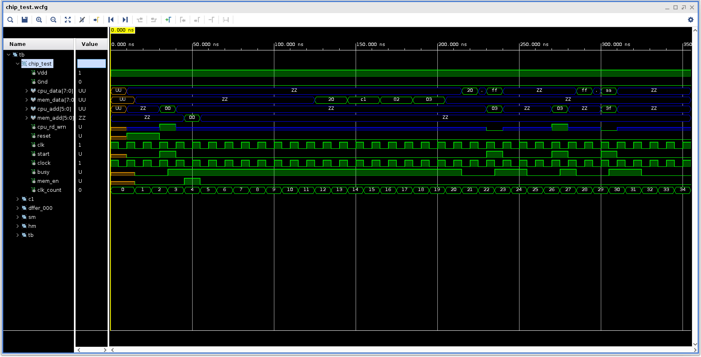

# CMPE 413 Final Project
This is the final project for CMPE 413 done by Daniel Cleaver and Mick Harrigan.

## Description
[Here](report/project_document.pdf) is the link to the designating file that describes what the project is in full. This repo contains the beginning VHDL code that is used to then later create the specified schematis as well as layouts for this system.
The other document used to create this system is [here](report/project_waveforms.pdf) and describes the expected waveforms to be created from the final system.



## Usage
Firstly, clone the repo into a suitable location for testing. From here make sure to update the line `CADENCE` in the Makefile.
Point this to the directory of the cds.lib and hdl.var files.

To then compile each module use the name of said module, or make all to make the full system.

## Information on Development
The `visualizer.py` script cannot be used on the dev systems as we cannot install the required library.
The output of this script shall be included in a later commit for the final version of the README.

## Hierarchy of Chip Design
```
Chip
├── Cache Block
│   ├── 2 Bit Row Tags
│   ├── 4x4 Byte Cells
│   ├── Byte Decoder
│   └── Valid Tags
├── Hit/Miss Detector
├── Output Enable (Address)
├── Output Enable (Data)
├── Registers
└── State Machine
```
### Explanation
1. Chip: Stuff
2. Cache Block
   1. row tags
   2. cells
   3. decoder
   4. valid
3. hit/miss
4. out en address
5. out en data
6. registers
7. state machine