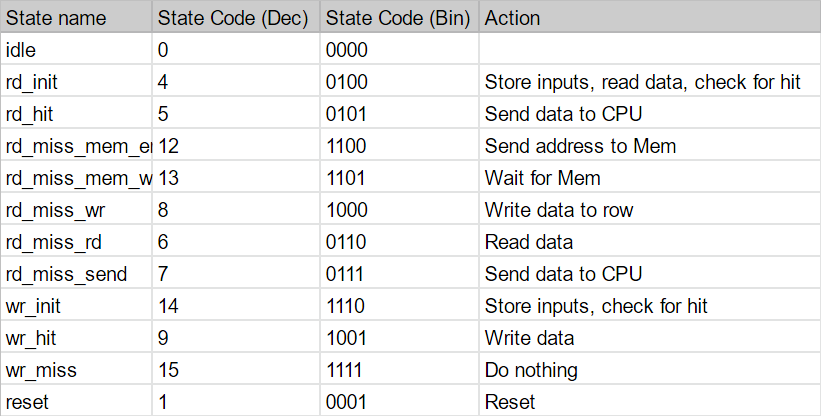
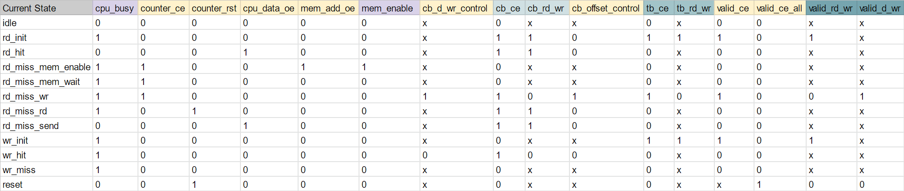
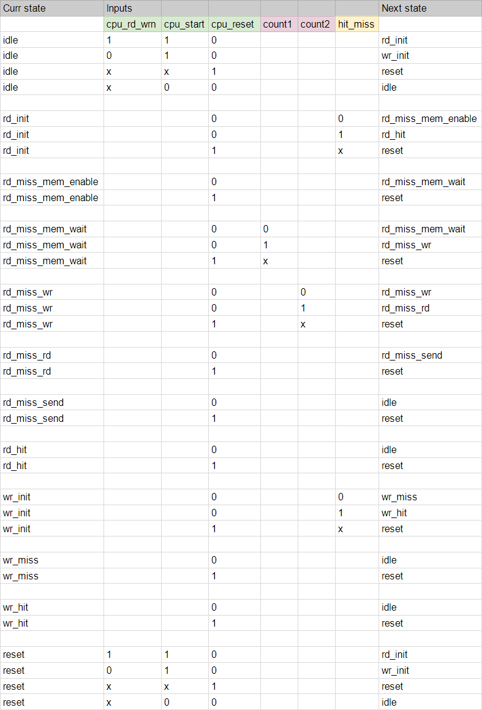
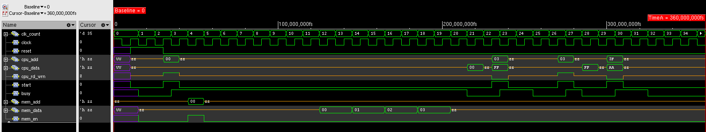
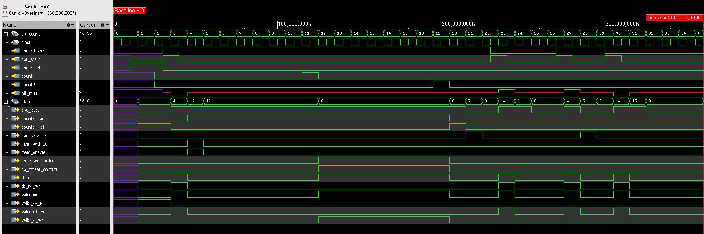
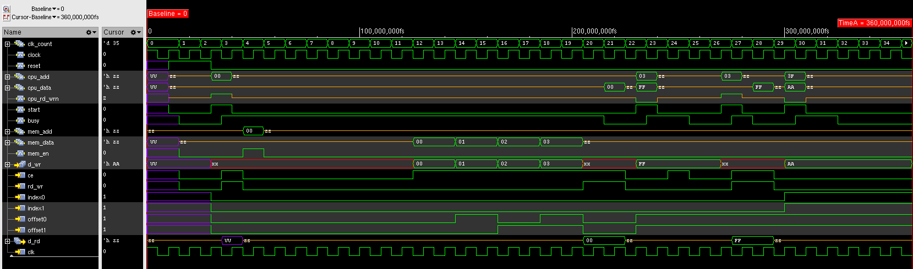

# Cache Design Project
Class: CMPE 413

Semester: Fall 2022

Completed by: Mick Harrigan and Daniel Cleaver

Date: 2022-11-22

## Description
This system from the top level chip all the way down uses many different connected parts to achieve the desired results.

The modules contained within this system are listed here as follows:

- State Machine
- Cache Block
- Tag Block
- Valid Chip Enable Generator
- Registers
- Output Enable Controllers
- Muxes
- 5 bit Counter
- 5 bit Comparator
- Hit/Miss Detector

This is further represented below with a deeper hierarchical design here below.

<!--tree diagram-->
```
Chip
├── 5 Bit Comparator
├── 5 Bit Counter
│   ├── 5 Bit Adder
│   ├── 5 Bit Buffer
│   └── 5 Bit Register
├── Cache Block
│   ├── 4x Cache 4 byte
│   │   ├── Cache Byte Decoder
│   │   └── Cache Cell 8
│   │       └── 8x Cache Cell 1
│   └── Cache Row Decoder
├── Hit/Miss Detector
│   └── 2 Bit Comparator
├── Muxes
│   └── 2 to 1 Mux
├── Output Enable Controllers
│   ├── CPU Data Output Enable
│   └── Memory Address Output Enable
├── Registers
│   ├── CPU Address Register
│   ├── CPU Data Register
│   └── RD_WR Register
├── State Machine
├── Tag Block
│   ├── 4x Cache Cell 2
│   └── Tag Decoder
└── Valid Chip Enable Generator
    └── Valid Bit Decoder
```

We used github to store files and track changes. Our repo can be found [here](https://github.com/MickHarrigan/cmpe413-proj).

## Design Strategy
### State Machine
The state machine acts as a controller for all other modules in the top-level chip. The current state is stored in a register, and the output signals are calcualted using combinational logic. In addition, the next state is determined based on the current state and the 
inputs. The behavior of the state machine is described by the following tables.

Table 1 shows the list of states and a 
description of each.

| Table 1: List of States |
|:--:|
||

<br />

Table 2 shows the outputs for each state.

| Table 2: State Output Table |
|:--:|
||

<br />

Table 3 shows the possible state transitions, based on the current state and inputs.

| Table 3: State Transition Table |
|:--:|
||

<br />

### 1 Bit Cache Cell
The single bit cell is built using a modified DFF, transmission gate, and a specialized decoder. Each of these parts are required for the operation of the cell as it is defined.

The modified DFF is used as the single bit storage system, with a write enable signal as its chip enable and a constant tie low for its reset.

The transmission gate controls whether or not the data bit is being read from or not.

The decoder selects if the cell should be reading or writing, and thus affects the output of the transmission gate and input of the DFF.

### 4x4 Byte Cache Block
The 4x4 Byte cache block stores all 16 Bytes of data through the use of 4 rows of 4 bytes of 1 bit cache cells.

This top level module for the cache takes the data byte and decodes other input signals to determine a write or read.

The data given to this system is then decoded and passed to the specific row to further parse the data. This is done through passing signals through to lower modules within this top level one.

Once the specified row is chosen that module gets the specific offset to either read or write from where it gets passed down into the specific byte and then cells themselves.


## VHDL Code
The source code for the project is located [here](https://github.com/MickHarrigan/cmpe413-proj/tree/main/src), in the src directory.


## Simulations
<!-- the below link could be dead -->
The following sections include waveforms for the major components of the cache. For each one, we used the top level testbench provided by the TA and Professor. This test shows full functionality of the design and includes each of the four major scenarios (read miss, read hit, write miss, write hit). To test the state machine and cache block, we replaced the chip's signals with signals specific to that module.

The testbench vhd file and input and output text files are located [here](https://github.com/MickHarrigan/cmpe413-proj/tree/main/testbenches/example_test1).

### Chip
Figure 1 shows the waveforms for the top-level chip. These results match the pdf that was provided near the beginning of the project.

|  |
|:--:|
|Figure 1: Testbench Waveforms for Chip|

### State Machine
Figure 2 shows the waveforms for the state machine. All the inputs and outputs are shown, along with the current state.

|  |
|:--:|
|Figure 2: Testbench Waveforms for State Machine|


### Cache Block
Figure 3 shows the waveforms for the cache block. This shows what happens when the cache is written to or read from.

|  |
|:--:|
|Figure 3: Testbench Waveforms for Cache Block|

## Work Breakdown
Breakdown of commits to the repo are listed [here](https://github.com/MickHarrigan/cmpe413-proj/commits/main). This is a chronicle of all changes and updates that each person did over the course of the development of this project. Looking deeper into the commit history shows a list of all changes that were pushed to the repo and from which user. Clicking on any of the commits will show which files were changed, added, removed, or moved.

In terms of lines written by each person, more were written in Dan's commits due to his dealing with longer files, whereas Mick spent more time on creating more smaller low-level files that were used throughout the porject. The overall amount of code used in the final version of this VHDL library is fairly even with a similarly even split of the workload. Lastly, writing of the documentation for the project was done simultaneously by both team members through the use of live coding. 

Moving forward, the plan for the layouts is to split up time on the primitives and then each work with the modules that we are most familiar with. This should result in an even time spent on the layouts as well as the VHDL.

## Conclusion
This project has taught many different skills and tools to be used later in both of our careers. From learning more simple things such as Git and software control structures, to more specific to this class with VHDL and hierarchical design.
We expect this to continue with the second half of the project with creating the layouts of the files and systems we designed to eventually have a fully functional cache system.

With all of this in mind this project has been a success in both learning and applying the topics learned in class as well as applicable to our careers as we prepare for our time after graduation.
