# Cache Design Project
Class: CMPE 413

Semester: Fall 2022

Completed by: Mick Harrigan and Daniel Cleaver

Date: 2022-12-13

## Description
This system from the top level chip all the way down uses many different connected parts to achieve the desired results.

The modules contained within this system are listed here as follows:

- State Machine
- Cache Block
- Tag Block
- Valid Chip Enable Generator
- Registers
- Output Enable Controllers
- Muxes
- 5 bit Counter
- 5 bit Comparator
- Hit/Miss Detector

This is further represented below with a deeper hierarchical design here below.

<!--tree diagram-->
```
Chip
├── 5 Bit Comparator
├── 5 Bit Counter
│   ├── 5 Bit Adder
│   ├── 5 Bit Buffer
│   └── 5 Bit Register
├── Cache Block
│   ├── 4x Cache 4 byte
│   │   ├── Cache Byte Decoder
│   │   └── Cache Cell 8
│   │       └── 8x Cache Cell 1
│   └── Cache Row Decoder
├── Hit/Miss Detector
│   └── 2 Bit Comparator
├── Muxes
│   └── 2 to 1 Mux
├── Output Enable Controllers
│   ├── CPU Data Output Enable
│   └── Memory Address Output Enable
├── Registers
│   ├── CPU Address Register
│   ├── CPU Data Register
│   └── RD_WR Register
├── State Machine
├── Tag Block
│   ├── 4x Cache Cell 2
│   └── Tag Decoder
└── Valid Chip Enable Generator
    └── Valid Bit Decoder
```

We used github to store files and track changes. Our repo can be found [here](https://github.com/MickHarrigan/cmpe413-proj).

## Design Strategy
### State Machine
The state machine acts as a controller for all other modules in the top-level chip. The current state is stored in a register, and the output signals are calcualted using combinational logic. In addition, the next state is determined based on the current state and the 
inputs. The behavior of the state machine is described by the following tables.

Table 1 shows the list of states and a 
description of each.

| Table 1: List of States |
|:--:|
|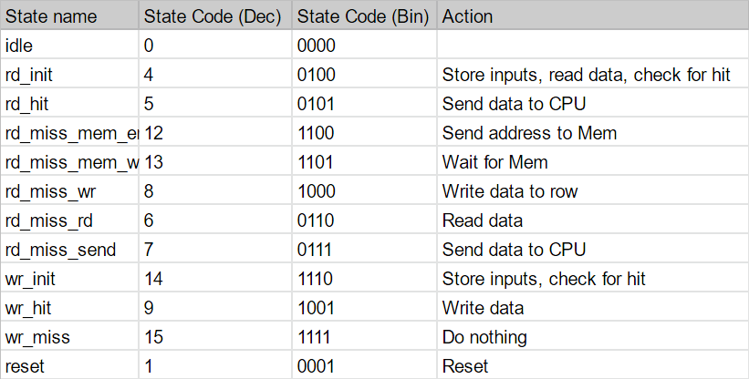|

<br />

Table 2 shows the outputs for each state.

| Table 2: State Output Table |
|:--:|
|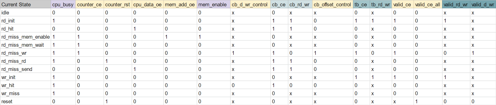|

<br />

Table 3 shows the possible state transitions, based on the current state and inputs.

| Table 3: State Transition Table |
|:--:|
|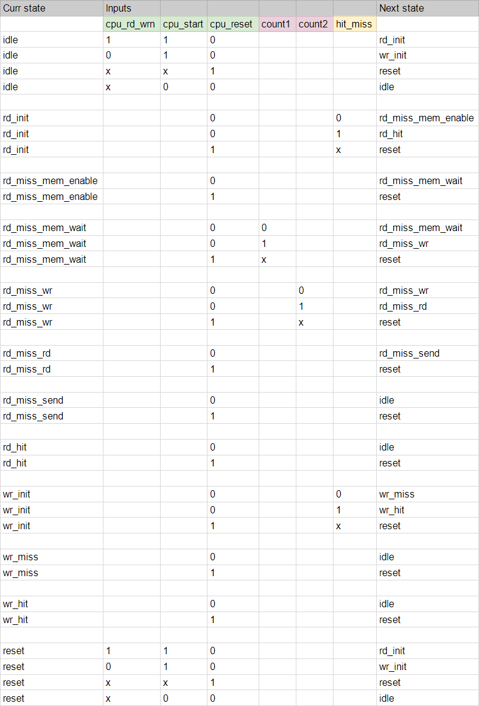|

<br />

### 1 Bit Cache Cell
The single bit cell is built using a modified DFF, transmission gate, and a specialized decoder. Each of these parts are required for the operation of the cell as it is defined.

The modified DFF is used as the single bit storage system, with a write enable signal as its chip enable and a constant tie low for its reset.

The transmission gate controls whether or not the data bit is being read from or not.

The decoder selects if the cell should be reading or writing, and thus affects the output of the transmission gate and input of the DFF.

### 4x4 Byte Cache Block
The 4x4 Byte cache block stores all 16 Bytes of data through the use of 4 rows of 4 bytes of 1 bit cache cells.

This top level module for the cache takes the data byte and decodes other input signals to determine a write or read.

The data given to this system is then decoded and passed to the specific row to further parse the data. This is done through passing signals through to lower modules within this top level one.

Once the specified row is chosen that module gets the specific offset to either read or write from where it gets passed down into the specific byte and then cells themselves.


## VHDL Code
The source code for the project is located [here](https://github.com/MickHarrigan/cmpe413-proj/tree/main/src), in the src directory.

The full contents of every file are also given in Appendix 1.

## Simulations
<!-- the below link could be dead -->
The following sections include waveforms for the major components of the cache. For each one, we used the top level testbench provided by the TA and Professor. This test shows full functionality of the design and includes each of the four major scenarios (read miss, read hit, write miss, write hit). To test the state machine and cache block, we replaced the chip's signals with signals specific to that module.

The testbench vhd file and input and output text files are located [here](https://github.com/MickHarrigan/cmpe413-proj/tree/main/testbenches/example_test1). The contents of these files are also shown in Appendix 2.

### Chip
Figure 1 shows the waveforms for the top-level chip. These results match the pdf that was provided near the beginning of the project.

| 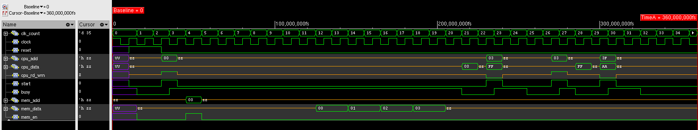 |
|:--:|
|Figure 1: Testbench Waveforms for Chip|

### State Machine
Figure 2 shows the waveforms for the state machine. All the inputs and outputs are shown, along with the current state.

| 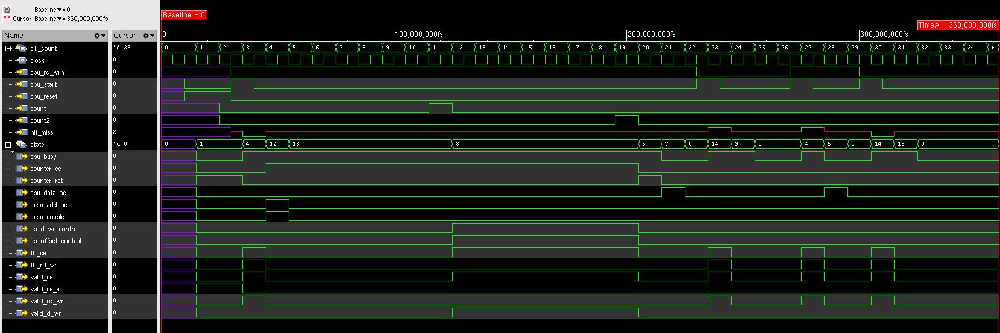 |
|:--:|
|Figure 2: Testbench Waveforms for State Machine|


### Cache Block
Figure 3 shows the waveforms for the cache block. This shows what happens when the cache is written to or read from.

| 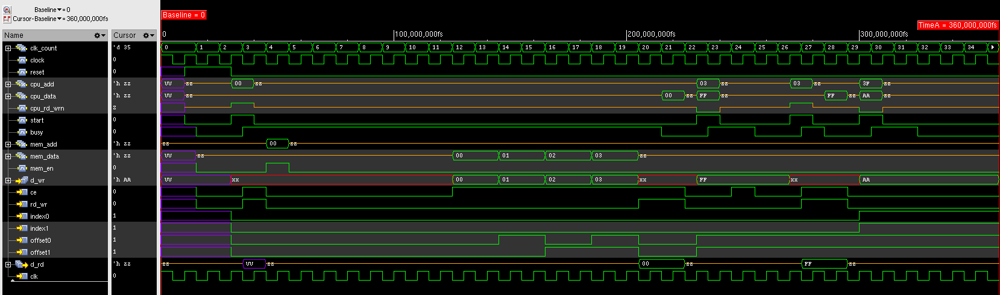 |
|:--:|
|Figure 3: Testbench Waveforms for Cache Block|

## Layouts and Schematics
The layouts for certain components are shown below. Each layout is followed by its the LVS output to verify that the the layouts we created are equivalent to the schematics from the VHDL code.

### cache_cell1
| 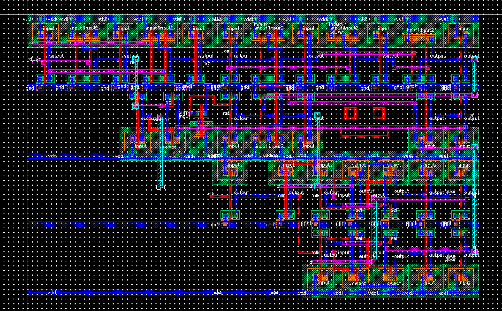 |
|:--:|
|Figure 4: Layout of a single bit cache cell|

| 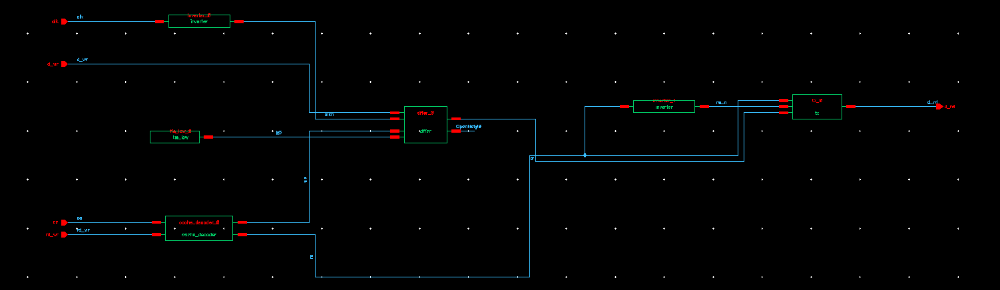 |
|:--:|
|Figure 5: Schematic of a single bit cache cell|

```
@(#)$CDS: LVS version 6.1.7-64b 09/27/2016 19:41 (sjfhw305) $

Command line: /afs/umbc.edu/software/cadence/installs/IC617/tools.lnx86/dfII/bin/64bit/LVS -dir /afs/umbc.edu/users/d/d/d163/home/cmpe413/cadence/LVS -l -t /afs/umbc.edu/users/d/d/d163/home/cmpe413/cadence/LVS/layout /afs/umbc.edu/users/d/d/d163/home/cmpe413/cadence/LVS/schematic
Like matching is enabled.
Using terminal names as correspondence points.
Compiling Diva LVS rules...

    Net-list summary for /afs/umbc.edu/users/d/d/d163/home/cmpe413/cadence/LVS/layout/netlist
       count
        43              nets
        5               terminals
        38              pmos
        38              nmos

    Net-list summary for /afs/umbc.edu/users/d/d/d163/home/cmpe413/cadence/LVS/schematic/netlist
       count
        43              nets
        7               terminals
        38              pmos
        38              nmos


    Terminal correspondence points
    N44       N9        ce
    N42       N12       clk
    N43       N11       d_rd
    N45       N7        d_wr
    N41       N10       rd_wr

Devices in the rules but not in the netlist:
        cap nfet pfet nmos4 pmos4

The net-lists match.

                             layout  schematic
                                instances
        un-matched              0       0      
        rewired                 0       0      
        size errors             0       0      
        pruned                  0       0      
        active                  76      76     
        total                   76      76     

                                  nets
        un-matched              0       0      
        merged                  0       0      
        pruned                  0       0      
        active                  43      43     
        total                   43      43     

                                terminals
        un-matched              0       0      
        matched but
        different type          0       0      
        total                   5       7      


Probe files from /afs/umbc.edu/users/d/d/d163/home/cmpe413/cadence/LVS/schematic

devbad.out:

netbad.out:

mergenet.out:

termbad.out:

prunenet.out:

prunedev.out:

audit.out:


Probe files from /afs/umbc.edu/users/d/d/d163/home/cmpe413/cadence/LVS/layout

devbad.out:

netbad.out:

mergenet.out:

termbad.out:

prunenet.out:

prunedev.out:

audit.out:

```
\pagebreak

### cache_block
| 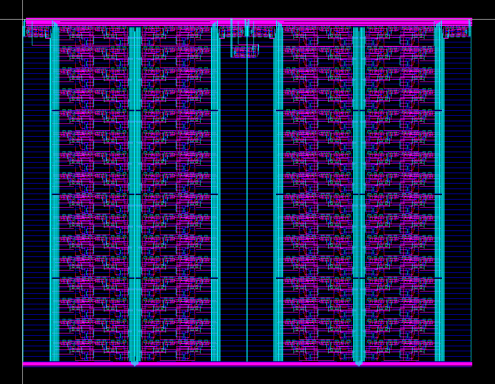 |
|:--:|
|Figure 6: Layout of the whole 4x4 Byte cache block|

| 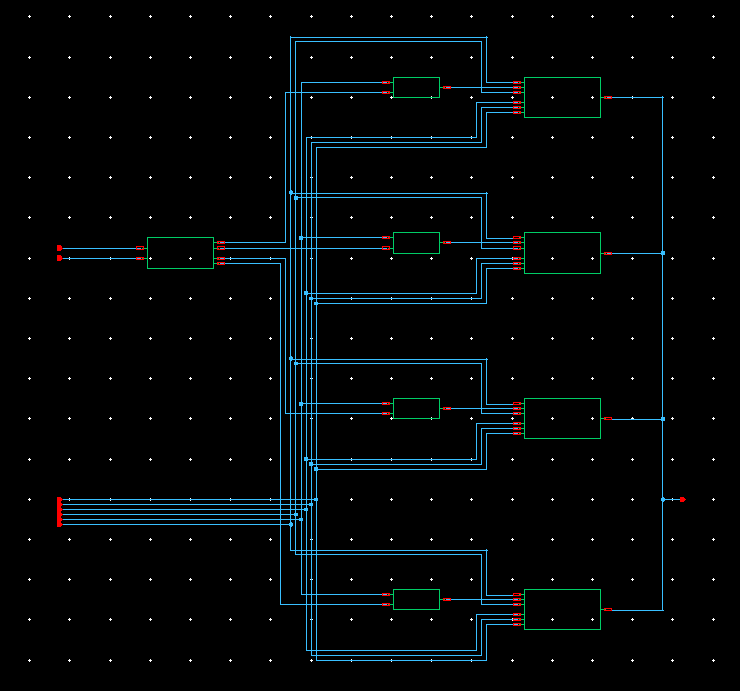 |
|:--:|
|Figure 7: Schematic of the whole 4x4 Byte cache block|

```
@(#)$CDS: LVS version 6.1.7-64b 09/27/2016 19:41 (sjfhw305) $

Command line: /afs/umbc.edu/software/cadence/installs/IC617/tools.lnx86/dfII/bin/64bit/LVS -dir /afs/umbc.edu/users/d/d/d163/home/cmpe413/cadence/LVS -l -t /afs/umbc.edu/users/d/d/d163/home/cmpe413/cadence/LVS/layout /afs/umbc.edu/users/d/d/d163/home/cmpe413/cadence/LVS/schematic
Like matching is enabled.
Using terminal names as correspondence points.
Compiling Diva LVS rules...

    Net-list summary for /afs/umbc.edu/users/d/d/d163/home/cmpe413/cadence/LVS/layout/netlist
       count
        4763            nets
        23              terminals
        4994            pmos
        4994            nmos

    Net-list summary for /afs/umbc.edu/users/d/d/d163/home/cmpe413/cadence/LVS/schematic/netlist
       count
        4763            nets
        25              terminals
        4994            pmos
        4994            nmos


    Terminal correspondence points
    N5141     N17       ce
    N5137     N31       clk
    N5143     N30       d_rd<0>
    N5140     N29       d_rd<1>
    N5138     N28       d_rd<2>
    N5135     N27       d_rd<3>
    N5131     N26       d_rd<4>
    N5129     N25       d_rd<5>
    N5126     N24       d_rd<6>
    N5124     N23       d_rd<7>
    N5144     N16       d_wr<0>
    N5142     N15       d_wr<1>
    N5139     N14       d_wr<2>
    N5136     N13       d_wr<3>
    N5134     N12       d_wr<4>
    N5130     N11       d_wr<5>
    N5127     N10       d_wr<6>
    N5125     N9        d_wr<7>
    N5146     N19       index0
    N5145     N20       index1
    N5133     N21       offset0
    N5132     N22       offset1
    N5128     N18       rd_wr

Devices in the netlist but not in the rules:
        pcapacitor
Devices in the rules but not in the netlist:
        cap nfet pfet nmos4 pmos4

The net-lists match.

                             layout  schematic
                                instances
        un-matched              0       0      
        rewired                 0       0      
        size errors             0       0      
        pruned                  0       0      
        active                  9988    9988   
        total                   9988    9988   

                                  nets
        un-matched              0       0      
        merged                  0       0      
        pruned                  0       0      
        active                  4763    4763   
        total                   4763    4763   

                                terminals
        un-matched              0       0      
        matched but
        different type          0       0      
        total                   23      25     


Probe files from /afs/umbc.edu/users/d/d/d163/home/cmpe413/cadence/LVS/schematic

devbad.out:

netbad.out:

mergenet.out:

termbad.out:

prunenet.out:

prunedev.out:

audit.out:


Probe files from /afs/umbc.edu/users/d/d/d163/home/cmpe413/cadence/LVS/layout

devbad.out:

netbad.out:

mergenet.out:

termbad.out:

prunenet.out:

prunedev.out:

audit.out:

```
\pagebreak

### counter5
| 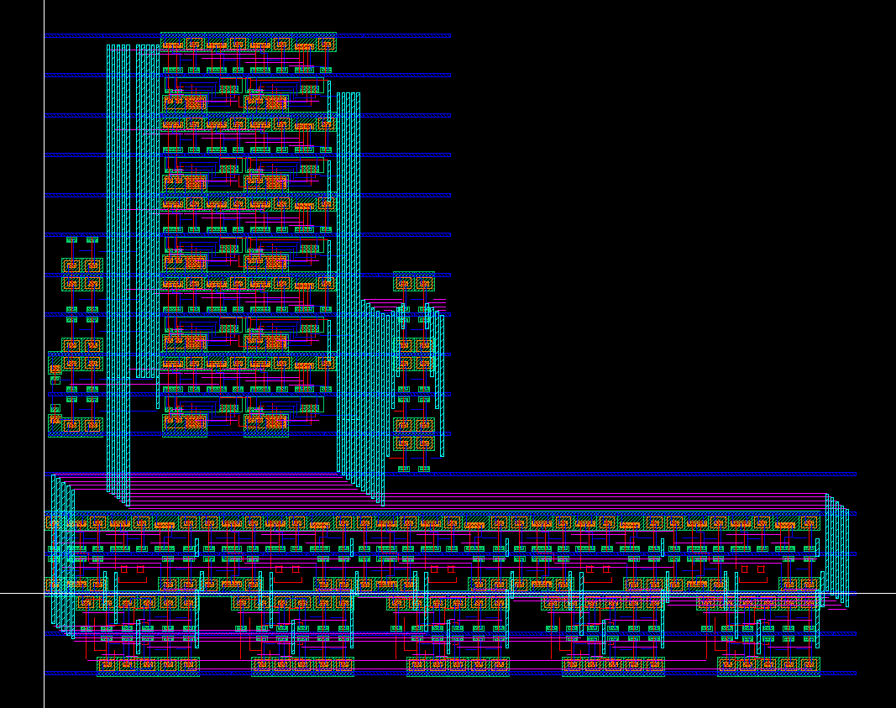 |
|:--:|
|Figure 8: Layout of the 5 bit counter|

| 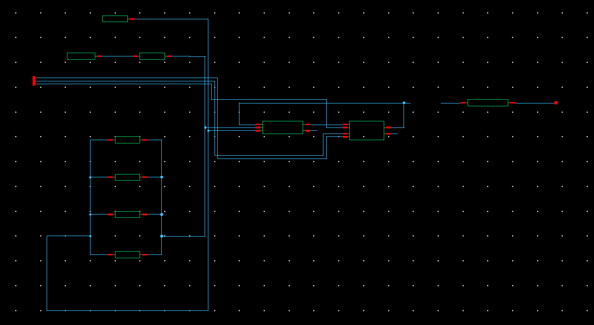 |
|:--:|
|Figure 9: Schematic of the 5 bit counter|

```
@(#)$CDS: LVS version 6.1.7-64b 09/27/2016 19:41 (sjfhw305) $

Command line: /afs/umbc.edu/software/cadence/installs/IC617/tools.lnx86/dfII/bin/64bit/LVS -dir /afs/umbc.edu/users/d/d/d163/home/cmpe413/cadence/LVS -l -t /afs/umbc.edu/users/d/d/d163/home/cmpe413/cadence/LVS/layout /afs/umbc.edu/users/d/d/d163/home/cmpe413/cadence/LVS/schematic
Like matching is enabled.
Using terminal names as correspondence points.
Compiling Diva LVS rules...

    Net-list summary for /afs/umbc.edu/users/d/d/d163/home/cmpe413/cadence/LVS/layout/netlist
       count
        285             nets
        8               terminals
        282             pmos
        282             nmos

    Net-list summary for /afs/umbc.edu/users/d/d/d163/home/cmpe413/cadence/LVS/schematic/netlist
       count
        285             nets
        10              terminals
        282             pmos
        282             nmos


    Terminal correspondence points
    N296      N11       ce
    N295      N15       clk
    N292      N23       q<0>
    N290      N22       q<1>
    N299      N21       q<2>
    N298      N14       q<3>
    N297      N13       q<4>
    N293      N12       rst

Devices in the netlist but not in the rules:
        pcapacitor
Devices in the rules but not in the netlist:
        cap nfet pfet nmos4 pmos4

The net-lists match.

                             layout  schematic
                                instances
        un-matched              0       0      
        rewired                 0       0      
        size errors             0       0      
        pruned                  0       0      
        active                  564     564    
        total                   564     564    

                                  nets
        un-matched              0       0      
        merged                  0       0      
        pruned                  0       0      
        active                  285     285    
        total                   285     285    

                                terminals
        un-matched              0       0      
        matched but
        different type          0       0      
        total                   8       10     


Probe files from /afs/umbc.edu/users/d/d/d163/home/cmpe413/cadence/LVS/schematic

devbad.out:

netbad.out:

mergenet.out:

termbad.out:

prunenet.out:

prunedev.out:

audit.out:


Probe files from /afs/umbc.edu/users/d/d/d163/home/cmpe413/cadence/LVS/layout

devbad.out:

netbad.out:

mergenet.out:

termbad.out:

prunenet.out:

prunedev.out:

audit.out:

```
\pagebreak

### mux2
| 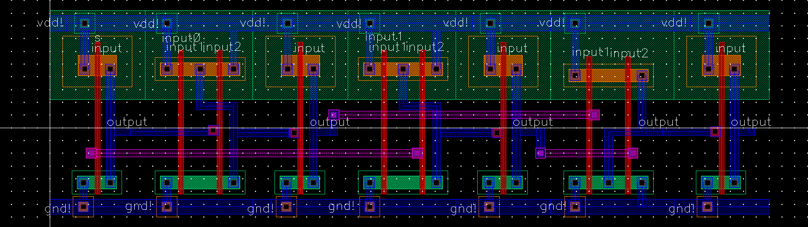 |
|:--:|
|Figure 10: Layout of the 2 to 1 bit mux|

| 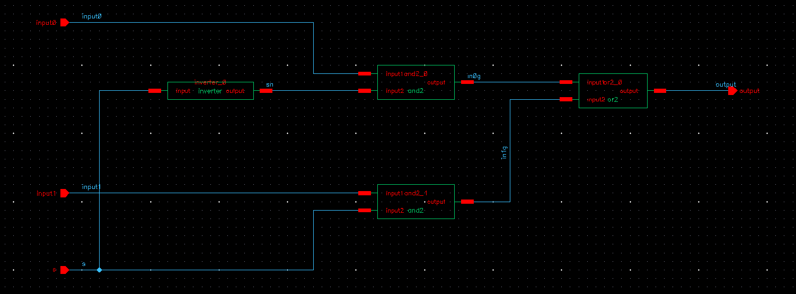 |
|:--:|
|Figure 11: Schematic of the 2 to 1 bit mux|

```
@(#)$CDS: LVS version 6.1.7-64b 09/27/2016 19:41 (sjfhw305) $

Command line: /afs/umbc.edu/software/cadence/installs/IC617/tools.lnx86/dfII/bin/64bit/LVS -dir /afs/umbc.edu/users/d/d/d163/home/cmpe413/cadence/LVS -l -t /afs/umbc.edu/users/d/d/d163/home/cmpe413/cadence/LVS/layout /afs/umbc.edu/users/d/d/d163/home/cmpe413/cadence/LVS/schematic
Like matching is enabled.
Using terminal names as correspondence points.
Compiling Diva LVS rules...

    Net-list summary for /afs/umbc.edu/users/d/d/d163/home/cmpe413/cadence/LVS/layout/netlist
       count
        15              nets
        4               terminals
        10              pmos
        10              nmos

    Net-list summary for /afs/umbc.edu/users/d/d/d163/home/cmpe413/cadence/LVS/schematic/netlist
       count
        15              nets
        6               terminals
        10              pmos
        10              nmos


    Terminal correspondence points
    N12       N8        input0
    N11       N7        input1
    N13       N2        output
    N14       N6        s

Devices in the netlist but not in the rules:
        pcapacitor
Devices in the rules but not in the netlist:
        cap nfet pfet nmos4 pmos4

The net-lists match.

                             layout  schematic
                                instances
        un-matched              0       0      
        rewired                 0       0      
        size errors             0       0      
        pruned                  0       0      
        active                  20      20     
        total                   20      20     

                                  nets
        un-matched              0       0      
        merged                  0       0      
        pruned                  0       0      
        active                  15      15     
        total                   15      15     

                                terminals
        un-matched              0       0      
        matched but
        different type          0       0      
        total                   4       6      


Probe files from /afs/umbc.edu/users/d/d/d163/home/cmpe413/cadence/LVS/schematic

devbad.out:

netbad.out:

mergenet.out:

termbad.out:

prunenet.out:

prunedev.out:

audit.out:


Probe files from /afs/umbc.edu/users/d/d/d163/home/cmpe413/cadence/LVS/layout

devbad.out:

netbad.out:

mergenet.out:

termbad.out:

prunenet.out:

prunedev.out:

audit.out:

```
\pagebreak

### statemachine
| 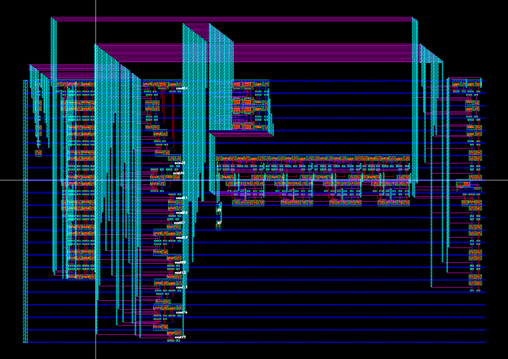 |
|:--:|
|Figure 12: Layout of the state machine|

| 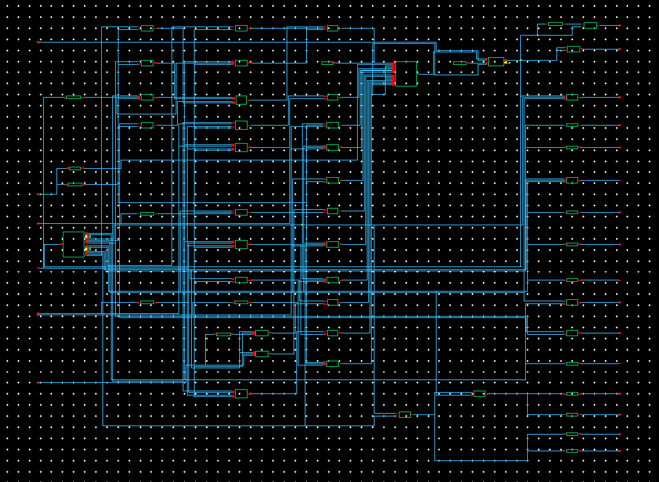 |
|:--:|
|Figure 13: Schematic of the state machine|

```
@(#)$CDS: LVS version 6.1.7-64b 09/27/2016 19:41 (sjfhw305) $

Command line: /afs/umbc.edu/software/cadence/installs/IC617/tools.lnx86/dfII/bin/64bit/LVS -dir /afs/umbc.edu/users/d/d/d163/home/cmpe413/cadence/LVS -l -t /afs/umbc.edu/users/d/d/d163/home/cmpe413/cadence/LVS/layout /afs/umbc.edu/users/d/d/d163/home/cmpe413/cadence/LVS/schematic
Like matching is enabled.
Using terminal names as correspondence points.
Compiling Diva LVS rules...

    Net-list summary for /afs/umbc.edu/users/d/d/d163/home/cmpe413/cadence/LVS/layout/netlist
       count
        439             nets
        23              terminals
        438             pmos
        438             nmos

    Net-list summary for /afs/umbc.edu/users/d/d/d163/home/cmpe413/cadence/LVS/schematic/netlist
       count
        439             nets
        25              terminals
        438             pmos
        438             nmos


    Terminal correspondence points
    N448      N67       cb_ce
    N439      N68       cb_d_wr_control
    N416      N65       cb_offset_control
    N451      N66       cb_rd_wr
    N433      N80       clk
    N425      N77       count1
    N424      N76       count2
    N420      N73       counter_ce
    N430      N72       counter_rst
    N440      N74       cpu_busy
    N429      N71       cpu_data_oe
    N422      N81       cpu_rd_wrn
    N417      N78       cpu_reset
    N419      N79       cpu_start
    N428      N75       hit_miss
    N412      N70       mem_add_oe
    N434      N69       mem_enable
    N413      N64       tb_ce
    N432      N63       tb_rd_wr
    N431      N62       valid_ce
    N426      N61       valid_ce_all
    N441      N59       valid_d_wr
    N418      N60       valid_rd_wr

Devices in the netlist but not in the rules:
        pcapacitor
Devices in the rules but not in the netlist:
        cap nfet pfet nmos4 pmos4

The net-lists match.

                             layout  schematic
                                instances
        un-matched              0       0      
        rewired                 0       0      
        size errors             0       0      
        pruned                  0       0      
        active                  876     876    
        total                   876     876    

                                  nets
        un-matched              0       0      
        merged                  0       0      
        pruned                  0       0      
        active                  439     439    
        total                   439     439    

                                terminals
        un-matched              0       0      
        matched but
        different type          0       0      
        total                   23      25     


Probe files from /afs/umbc.edu/users/d/d/d163/home/cmpe413/cadence/LVS/schematic

devbad.out:

netbad.out:

mergenet.out:

termbad.out:

prunenet.out:

prunedev.out:

audit.out:


Probe files from /afs/umbc.edu/users/d/d/d163/home/cmpe413/cadence/LVS/layout

devbad.out:

netbad.out:

mergenet.out:

termbad.out:

prunenet.out:

prunedev.out:

audit.out:

```
\pagebreak

### chip
| 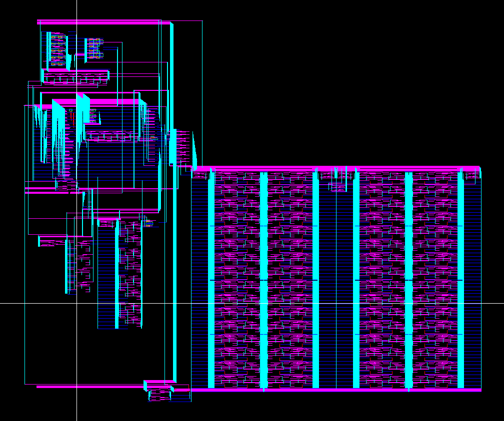 |
|:--:|
|Figure 14: Layout of the entire chip|

| 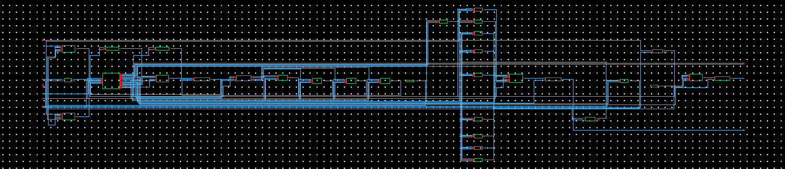 |
|:--:|
|Figure 15: Schematic of the entire chip|

```
@(#)$CDS: LVS version 6.1.7-64b 09/27/2016 19:41 (sjfhw305) $

Command line: /afs/umbc.edu/software/cadence/installs/IC617/tools.lnx86/dfII/bin/64bit/LVS -dir /afs/umbc.edu/users/d/d/d163/home/cmpe413/cadence/LVS -l -t /afs/umbc.edu/users/d/d/d163/home/cmpe413/cadence/LVS/layout /afs/umbc.edu/users/d/d/d163/home/cmpe413/cadence/LVS/schematic
Like matching is enabled.
Using terminal names as correspondence points.
Compiling Diva LVS rules...

    Net-list summary for /afs/umbc.edu/users/d/d/d163/home/cmpe413/cadence/LVS/layout/netlist
       count
        6266            nets
        36              terminals
        6538            pmos
        6538            nmos

    Net-list summary for /afs/umbc.edu/users/d/d/d163/home/cmpe413/cadence/LVS/schematic/netlist
       count
        6266            nets
        38              terminals
        6538            pmos
        6538            nmos


    Terminal correspondence points
    N6691     N58       busy
    N6701     N97       clk
    N6702     N33       cpu_add<0>
    N6698     N32       cpu_add<1>
    N6690     N31       cpu_add<2>
    N6685     N30       cpu_add<3>
    N6682     N29       cpu_add<4>
    N6679     N28       cpu_add<5>
    N6695     N94       cpu_data<0>
    N6689     N93       cpu_data<1>
    N6684     N92       cpu_data<2>
    N6680     N91       cpu_data<3>
    N6715     N90       cpu_data<4>
    N6710     N89       cpu_data<5>
    N6707     N88       cpu_data<6>
    N6704     N87       cpu_data<7>
    N6688     N95       cpu_rd_wrn
    N6694     N27       gnd
    N6714     N107      mem_add<0>
    N6709     N66       mem_add<1>
    N6706     N65       mem_add<2>
    N6703     N64       mem_add<3>
    N6699     N63       mem_add<4>
    N6692     N62       mem_add<5>
    N6681     N106      mem_data<0>
    N6716     N105      mem_data<1>
    N6711     N104      mem_data<2>
    N6708     N103      mem_data<3>
    N6705     N102      mem_data<4>
    N6700     N101      mem_data<5>
    N6693     N100      mem_data<6>
    N6687     N99       mem_data<7>
    N6686     N61       mem_en
    N6712     N98       reset
    N6713     N96       start
    N6683     N36       vdd

Devices in the netlist but not in the rules:
        pcapacitor
Devices in the rules but not in the netlist:
        cap nfet pfet nmos4 pmos4

The net-lists match.

                             layout  schematic
                                instances
        un-matched              0       0      
        rewired                 0       0      
        size errors             0       0      
        pruned                  0       0      
        active                  13076   13076  
        total                   13076   13076  

                                  nets
        un-matched              0       0      
        merged                  0       0      
        pruned                  0       0      
        active                  6266    6266   
        total                   6266    6266   

                                terminals
        un-matched              0       0      
        matched but
        different type          0       0      
        total                   36      38     


Probe files from /afs/umbc.edu/users/d/d/d163/home/cmpe413/cadence/LVS/schematic

devbad.out:

netbad.out:

mergenet.out:

termbad.out:
? Terminal gnd is floating in the schematic.
? Terminal vdd is floating in the schematic.

prunenet.out:

prunedev.out:

audit.out:


Probe files from /afs/umbc.edu/users/d/d/d163/home/cmpe413/cadence/LVS/layout

devbad.out:

netbad.out:

mergenet.out:

termbad.out:
? Terminal gnd is floating in the layout.
? Terminal vdd is floating in the layout.

prunenet.out:

prunedev.out:

audit.out:

```

## Work Breakdown
Breakdown of commits to the repo are listed [here](https://github.com/MickHarrigan/cmpe413-proj/commits/main). This is a chronicle of all changes and updates that each person did over the course of the development of this project. Looking deeper into the commit history shows a list of all changes that were pushed to the repo and from which user. Clicking on any of the commits will show which files were changed, added, removed, or moved.

In terms of lines written by each person, more were written in Dan's commits due to his dealing with longer files, whereas Mick spent more time on creating more smaller low-level files that were used throughout the porject. The overall amount of code used in the final version of this VHDL library is fairly even with a similarly even split of the workload. Lastly, writing of the documentation for the project was done simultaneously by both team members through the use of live coding. 

While working on the layouts, we split up time on the primitives and we both worked with the modules that we are most familiar with. Dan spent more time working on the larger, higher-level modules and Mick created more of the basic components. We also spent time working side by side when both of us were working on the same layout at once.

## Conclusion
This project has taught many different skills and tools to be used later in both of our careers. From learning more simple things such as Git and software control structures, to more specific to this class with VHDL and hierarchical design.
We expect this to continue with the second half of the project with creating the layouts of the files and systems we designed to eventually have a fully functional cache system.

The creation of the layouts was a task that required a great deal of time and effort for the two of us. We spent much time trying to organize and create our VHDL code into a true system and were able to do so for this report to be made.

With all of this in mind this project has been a success in both learning and applying the topics learned in class as well as applicable to our careers as we prepare for our time after graduation.

\pagebreak

## Appendix 1: VHDL Source Code

```
-- File: chip.vhd
-- Top level cache

library STD;
library IEEE;
use IEEE.std_logic_1164.all;

entity chip is
    port(
        cpu_add     : in  std_logic_vector(5 downto 0);
        cpu_data    : inout  std_logic_vector(7 downto 0);
        cpu_rd_wrn  : in  std_logic;    
        start       : in  std_logic;
        clk         : in  std_logic;
        reset       : in  std_logic;
        mem_data    : in  std_logic_vector(7 downto 0);
        Vdd         : in  std_logic;
        Gnd         : in  std_logic;
        busy        : out std_logic;
        mem_en      : out std_logic;
        mem_add     : out std_logic_vector(5 downto 0)
    );
end chip;

architecture structural of chip is
    component tie_low
        port(
            output: out std_logic
        );
    end component;

    component tie_high
        port(
            output: out std_logic
        );
    end component;

    -- state machine
    component statemachine
        port(
            clk             : in std_logic;

            -- Inputs
            cpu_rd_wrn      : in std_logic;
            cpu_start       : in std_logic;
            cpu_reset       : in std_logic;

            count1          : in std_logic;
            count2          : in std_logic;

            hit_miss        : in std_logic;

            -- Outputs
            cpu_busy        : out std_logic;

            counter_ce      : out std_logic;
            counter_rst     : out std_logic;

            cpu_data_oe     : out std_logic;
            mem_add_oe      : out std_logic;

            mem_enable      : out std_logic;

            cb_d_wr_control : out std_logic;

            cb_ce           : out std_logic;
            cb_rd_wr        : out std_logic;

            cb_offset_control   : out std_logic;
        
            tb_ce           : out std_logic;
            tb_rd_wr        : out std_logic;

            valid_ce        : out std_logic;
            valid_ce_all    : out std_logic;

            valid_rd_wr     : out std_logic;
            valid_d_wr      : out std_logic
        );
    end component;

    -- cache block
    component cache_block
        port(
            d_wr    : in std_logic_vector(7 downto 0);
            ce      : in std_logic;
            rd_wr   : in std_logic;
            index0  : in std_logic;
            index1  : in std_logic;
            offset0 : in std_logic;
            offset1 : in std_logic;
            d_rd    : out std_logic_vector(7 downto 0);
            clk     : in std_logic
        );
    end component;
    -- tag block
    component tag_block
        port(
            d_wr    : in std_logic_vector(1 downto 0);
            ce      : in std_logic;
            rd_wr   : in std_logic;
            index0  : in std_logic;
            index1  : in std_logic;
            d_rd    : out std_logic_vector(1 downto 0);
            clk     : in std_logic
        );
    end component;
    -- "valid" (4 cells of cache)
    component cache_cell1
        port(
            d_wr    : in std_logic;
            ce      : in std_logic;
            rd_wr   : in std_logic;
            d_rd    : out std_logic;
            clk     : in std_logic
        );
    end component;

    component valid_ce_gen
        port(
            index0:         in std_logic;
            index1:         in std_logic;
            valid_ce:       in std_logic;
            valid_ce_all:   in std_logic;
            valid_ce0:     out std_logic;
            valid_ce1:     out std_logic;
            valid_ce2:     out std_logic;
            valid_ce3:     out std_logic
        );
    end component;

    component Dlatch
        port ( d   : in  std_logic;
         clk : in  std_logic;
         q   : out std_logic;
         qbar: out std_logic);
    end component;

    component dlatch6
        port(
        d       : in std_logic_vector(5 downto 0);
        clk     : in std_logic;
        q       : out std_logic_vector(5 downto 0);
        qbar    : out std_logic_vector(5 downto 0)
    );
    end component;

    component dlatch8
        port(
        d       : in std_logic_vector(7 downto 0);
        clk     : in std_logic;
        q       : out std_logic_vector(7 downto 0);
        qbar    : out std_logic_vector(7 downto 0)
    );
    end component;

    component mux2
        port(
            input0  : in std_logic;
            input1  : in std_logic;
            s       : in std_logic;
            output  : out std_logic
        );
    end component;

    component bus_creator2
        port(
            input1  : in std_logic;
            input0  : in std_logic;
            output  : out std_logic_vector(1 downto 0)
        );
    end component;

    component bus_creator6
        port(
            input5  : in std_logic;
            input4  : in std_logic;
            input3  : in std_logic;
            input2  : in std_logic;
            input1  : in std_logic;
            input0  : in std_logic;
            output  : out std_logic_vector(5 downto 0)
        );
    end component;

    -- oe_d
    component output_enable8
        port(
            input   : in std_logic_vector(7 downto 0);
            oe      : in std_logic;
            output  : out std_logic_vector(7 downto 0)
        );
    end component;
    -- oe_a
    component output_enable6
        port(
            input   : in std_logic_vector(5 downto 0);
            oe      : in std_logic;
            output  : out std_logic_vector(5 downto 0)
        );
    end component;
    -- counter
    component counter5
        port(
            clk : in std_logic;
            ce  : in std_logic;
            rst : in std_logic;
            q   : out std_logic_vector(4 downto 0)
        );
    end component;

    component comparator5s
        port(
            input1      : in std_logic_vector(4 downto 0);
            input2_0    : in std_logic;
            input2_1    : in std_logic;
            input2_2    : in std_logic;
            input2_3    : in std_logic;
            input2_4    : in std_logic;
            output      : out std_logic
        );
    end component;
    -- hit miss detector
    component hit_miss_detector
        port(
            input1  : in std_logic_vector(1 downto 0);
            input2  : in std_logic_vector(1 downto 0);
            valid   : in std_logic;
            output  : out std_logic
        );
    end component;

    for tie_low_0: tie_low use entity work.tie_low(structural);

    for tie_high_0: tie_high use entity work.tie_high(structural);

    for latch_cpu_add: dlatch6 use entity work.dlatch6(structural);

    for latch_cpu_data: dlatch8 use entity work.dlatch8(structural);

    for latch_cpu_rd_wrn: Dlatch use entity work.Dlatch(structural);

    for sm: statemachine use entity work.statemachine(structural);

    for counter: counter5 use entity work.counter5(structural);

    for comp_0, comp_1: comparator5s use entity work.comparator5s(structural);

    for mux2_0, mux2_1, mux2_2, mux2_3, mux2_4, mux2_5, mux2_6, mux2_7, mux2_8,
        mux2_9
        : mux2 use entity work.mux2(structural);

    for cb: cache_block use entity work.cache_block(structural);

    for bus_creator2_tb_d_wr, bus_creator2_hm_tag: bus_creator2 use entity work.bus_creator2(structural);

    for tb: tag_block use entity work.tag_block(structural);

    for valid_ce_gen_0: valid_ce_gen use entity work.valid_ce_gen(structural);

    for valid0, valid1, valid2, valid3
        : cache_cell1 use entity work.cache_cell1(structural);

    for hm: hit_miss_detector use entity work.hit_miss_detector(structural);

    for oe_cpu_data: output_enable8 use entity work.output_enable8(structural);

    for bus_creator6_mem_add: bus_creator6 use entity work.bus_creator6(structural);

    for oe_mem_add: output_enable6 use entity work.output_enable6(structural);

    
    signal b0, b1: std_logic;

    signal cpu_add_stored: std_logic_vector(5 downto 0);
    signal cpu_rd_wrn_stored: std_logic;
    signal cpu_data_stored: std_logic_vector(7 downto 0);

    signal counter_ce, counter_rst: std_logic;
    signal counter_q: std_logic_vector(4 downto 0);

    signal count_to_7, count_to_15: std_logic;

    signal cb_d_wr_control: std_logic;
    signal cb_d_wr: std_logic_vector(7 downto 0);
    signal cb_offset_control, cb_offset0, cb_offset1: std_logic;
    signal cb_ce, cb_rd_wr: std_logic;
    signal cb_d_rd: std_logic_vector(7 downto 0);

    signal tb_ce, tb_rd_wr: std_logic; 
    signal tb_d_wr, tb_d_rd: std_logic_vector(1 downto 0);

    signal valid_ce, valid_ce_all, valid_rd_wr, valid_d_wr, valid_d_rd: std_logic;
    signal valid_ce0, valid_ce1, valid_ce2, valid_ce3: std_logic;

    signal hit_miss: std_logic;
    signal hm_tag: std_logic_vector(1 downto 0);
    
    signal mem_add_out: std_logic_vector(5 downto 0);
    signal cpu_data_oe, mem_add_oe: std_logic;
    
begin
    tie_low_0: tie_low port map(b0);
    tie_high_0: tie_high port map(b1);

    latch_cpu_add: dlatch6 port map(cpu_add, start, cpu_add_stored, open);

    latch_cpu_rd_wrn: Dlatch port map(cpu_rd_wrn, start, cpu_rd_wrn_stored, open);

    latch_cpu_data: dlatch8 port map(cpu_data, start, cpu_data_stored, open);

    sm: statemachine port map(
        clk,
        cpu_rd_wrn_stored, start, reset,
        count_to_7, count_to_15,
        hit_miss,
        busy,
        counter_ce, counter_rst,
        cpu_data_oe, mem_add_oe,
        mem_en,
        cb_d_wr_control,
        cb_ce, cb_rd_wr,
        cb_offset_control,
        tb_ce, tb_rd_wr,
        valid_ce, valid_ce_all,
        valid_rd_wr, valid_d_wr
    );

    counter: counter5 port map(clk, counter_ce, counter_rst, counter_q);
    -- compare counter5 to 2 values (7 and 15)
    comp_0: comparator5s port map(counter_q, b1, b1, b1, b0, b0, count_to_7);
    comp_1: comparator5s port map(counter_q, b1, b1, b1, b1, b0, count_to_15);
        
    -- Select the data given to the cache
    mux2_0: mux2 port map(cpu_data_stored(0), mem_data(0), cb_d_wr_control, cb_d_wr(0));
    mux2_1: mux2 port map(cpu_data_stored(1), mem_data(1), cb_d_wr_control, cb_d_wr(1));
    mux2_2: mux2 port map(cpu_data_stored(2), mem_data(2), cb_d_wr_control, cb_d_wr(2));
    mux2_3: mux2 port map(cpu_data_stored(3), mem_data(3), cb_d_wr_control, cb_d_wr(3));
    mux2_4: mux2 port map(cpu_data_stored(4), mem_data(4), cb_d_wr_control, cb_d_wr(4));
    mux2_5: mux2 port map(cpu_data_stored(5), mem_data(5), cb_d_wr_control, cb_d_wr(5));
    mux2_6: mux2 port map(cpu_data_stored(6), mem_data(6), cb_d_wr_control, cb_d_wr(6));
    mux2_7: mux2 port map(cpu_data_stored(7), mem_data(7), cb_d_wr_control, cb_d_wr(7));
        
    -- Select the offset given to the cache
    mux2_8: mux2 port map(cpu_add_stored(0), counter_q(1), cb_offset_control, cb_offset0);
    mux2_9: mux2 port map(cpu_add_stored(1), counter_q(2), cb_offset_control, cb_offset1);

    cb: cache_block port map(
        cb_d_wr, cb_ce, cb_rd_wr,
        cpu_add_stored(2), cpu_add_stored(3), cb_offset0, cb_offset1,
        cb_d_rd, clk
    );

    bus_creator2_tb_d_wr: bus_creator2 port map(cpu_add_stored(5), cpu_add_stored(4), tb_d_wr);
    tb: tag_block port map(tb_d_wr, tb_ce, tb_rd_wr, cpu_add_stored(2), cpu_add_stored(3), tb_d_rd, clk);

    valid_ce_gen_0: valid_ce_gen port map(
        cpu_add_stored(2), cpu_add_stored(3),
        valid_ce, valid_ce_all, 
        valid_ce0, valid_ce1, valid_ce2, valid_ce3
    );
    valid0: cache_cell1 port map(valid_d_wr, valid_ce0, valid_rd_wr, valid_d_rd, clk);
    valid1: cache_cell1 port map(valid_d_wr, valid_ce1, valid_rd_wr, valid_d_rd, clk);
    valid2: cache_cell1 port map(valid_d_wr, valid_ce2, valid_rd_wr, valid_d_rd, clk);
    valid3: cache_cell1 port map(valid_d_wr, valid_ce3, valid_rd_wr, valid_d_rd, clk);

    bus_creator2_hm_tag: bus_creator2 port map(cpu_add_stored(3), cpu_add_stored(2), hm_tag);
    hm: hit_miss_detector port map(tb_d_rd, hm_tag, valid_d_rd, hit_miss);
    
    oe_cpu_data: output_enable8 port map(cb_d_rd, cpu_data_oe, cpu_data);

    bus_creator6_mem_add: bus_creator6 port map(
        cpu_add_stored(5), 
        cpu_add_stored(4), 
        cpu_add_stored(3), 
        cpu_add_stored(2), 
        b0, b0,
        mem_add_out
    );
    oe_mem_add: output_enable6 port map(mem_add_out, mem_add_oe, mem_add);

end structural;


-- File: basics/buff.vhd
-- Buffer using 2 inverters

library STD;
library IEEE;
use IEEE.std_logic_1164.all;

entity buff is
    port(
        input   : in std_logic;
        output  : out std_logic
    );
end buff;

architecture structural of buff is
    component inverter
        port(
            input   : in std_logic;
            output  : out std_logic
        );
    end component;

    for inverter_0, inverter_1: inverter use entity work.inverter(structural);
    
    signal x: std_logic;

begin
    inverter_0: inverter port map(input, x);
    inverter_1: inverter port map(x, output);

end structural;


-- File: basics/bus_creator2.vhd
-- 2 bit bus creator, converts 2 input bits to a single bus

library STD;
library IEEE;
use IEEE.std_logic_1164.all;

entity bus_creator2 is
    port(
        input1  : in std_logic;
        input0  : in std_logic;
        output  : out std_logic_vector(1 downto 0)
    );
end bus_creator2;

architecture structural of bus_creator2 is
    component buff
        port(
            input   : in std_logic;
            output  : out std_logic
        );
    end component;

    for buff_0, buff_1: buff use entity work.buff(structural);

begin

    buff_0: buff port map(input0, output(0));
    buff_1: buff port map(input1, output(1));

end structural;
    


-- File: basics/bus_creator6.vhd
-- 6 bit bus creator, converts 6 input lines into a single 6 bit bus

library STD;
library IEEE;
use IEEE.std_logic_1164.all;

entity bus_creator6 is
    port(
        input5  : in std_logic;
        input4  : in std_logic;
        input3  : in std_logic;
        input2  : in std_logic;
        input1  : in std_logic;
        input0  : in std_logic;
        output  : out std_logic_vector(5 downto 0)
    );
end bus_creator6;

architecture structural of bus_creator6 is
    component buff
        port(
            input   : in std_logic;
            output  : out std_logic
        );
    end component;

    for buff_0, buff_1, buff_2, buff_3, buff_4, buff_5: buff use entity work.buff(structural);

begin

    buff_0: buff port map(input0, output(0));
    buff_1: buff port map(input1, output(1));
    buff_2: buff port map(input2, output(2));
    buff_3: buff port map(input3, output(3));
    buff_4: buff port map(input4, output(4));
    buff_5: buff port map(input5, output(5));

end structural;
    


-- File: basics/comparator2.vhd
-- 2-bit comparator
-- Outputs 1 when inputs are equal

library STD;
library IEEE;
use IEEE.std_logic_1164.all;

entity comparator2 is
    port(
        input1  : in std_logic_vector(1 downto 0);
        input2  : in std_logic_vector(1 downto 0);
        output  : out std_logic
    );
end comparator2;

architecture structural of comparator2 is
    component xor2
        port(
            input1  : in std_logic;
            input2  : in std_logic;
            output  : out std_logic
        );
    end component;

    component nor2
        port(
            input1  : in std_logic;
            input2  : in std_logic;
            output  : out std_logic
        );
    end component;

    for xor2_0, xor2_1: xor2 use entity work.xor2(structural);
    for nor2_0: nor2 use entity work.nor2(structural);

    signal x, y: std_logic;

begin
    xor2_0: xor2 port map(input1(0), input2(0), x);
    xor2_1: xor2 port map(input1(1), input2(1), y);

    nor2_0: nor2 port map(x, y, output);

end structural;


-- File: basics/comparator5s.vhd
-- 5 bit comparator (different types of inputs)
-- outputs 1 when input1 and all equivalent bits of input2 are equal

library STD;
library IEEE;
use IEEE.std_logic_1164.all;

entity comparator5s is
    port(
        input1      : in std_logic_vector(4 downto 0);
        input2_0    : in std_logic;
        input2_1    : in std_logic;
        input2_2    : in std_logic;
        input2_3    : in std_logic;
        input2_4    : in std_logic;
        output      : out std_logic
    );
end comparator5s;

architecture structural of comparator5s is
    component xor2
        port(
            input1  : in std_logic;
            input2  : in std_logic;
            output  : out std_logic
        );
    end component;

    component nor2
        port(
            input1  : in std_logic;
            input2  : in std_logic;
            output  : out std_logic
        );
    end component;

    component or4
        port(
            input1  : in std_logic;
            input2  : in std_logic;
            input3  : in std_logic;
            input4  : in std_logic;
            output  : out std_logic
        );
    end component;

    for xor2_0, xor2_1, xor2_2, xor2_3, xor2_4: xor2 use entity work.xor2(structural);
    for nor2_0: nor2 use entity work.nor2(structural);
    for or4_0: or4 use entity work.or4(structural);

    signal a,b,c,d,e,f: std_logic;

begin
    xor2_0: xor2 port map(input1(0), input2_0, a);
    xor2_1: xor2 port map(input1(1), input2_1, b);
    xor2_2: xor2 port map(input1(2), input2_2, c);
    xor2_3: xor2 port map(input1(3), input2_3, d);
    xor2_4: xor2 port map(input1(4), input2_4, e);

    or4_0: or4 port map(a, b, c, d, f);

    nor2_0: nor2 port map(f, e, output);

end structural;


-- File: basics/decoder2to4.vhd
library STD;
library IEEE;
use IEEE.std_logic_1164.all;

entity decoder2to4 is
    port(
        input0  : in std_logic;
        input1  : in std_logic;
        output0 : out std_logic;
        output1 : out std_logic;
        output2 : out std_logic;
        output3 : out std_logic
    );
end decoder2to4;

architecture structural of decoder2to4 is 
    -- components
    component and2
        port(
            input1  : in std_logic;
            input2  : in std_logic;
            output  : out std_logic
        );
    end component;

    component inverter
        port(
            input   : in std_logic;
            output  : out std_logic
        );
    end component;

    for and2_0, and2_1, and2_2, and2_3: and2 use entity work.and2(structural);
    for inv_0, inv_1: inverter use entity work.inverter(structural);

    -- optional wires
    signal in0n: std_logic;
    signal in1n: std_logic;

begin
    inv_0: inverter port map(input0, in0n);
    inv_1: inverter port map(input1, in1n);

    and2_0: and2 port map(in0n, in1n, output0);
    and2_1: and2 port map(input0, in1n, output1);
    and2_2: and2 port map(in0n, input1, output2);
    and2_3: and2 port map(input0, input1, output3);

end structural;


-- File: basics/decoder3to8.vhd
library STD;
library IEEE;
use IEEE.std_logic_1164.all;

entity decoder3to8 is
    port(
        en      : in std_logic;
        input0  : in std_logic;
        input1  : in std_logic;
        input2  : in std_logic;
        output0 : out std_logic;
        output1 : out std_logic;
        output2 : out std_logic;
        output3 : out std_logic;
        output4 : out std_logic;
        output5 : out std_logic;
        output6 : out std_logic;
        output7 : out std_logic
    );
end decoder3to8;

architecture structural of decoder3to8 is
    component and3
        port(
            input1  : in std_logic;
            input2  : in std_logic;
            input3  : in std_logic;
            output  : out std_logic
        );
    end component;

    component and2
        port(
            input1  : in std_logic;
            input2  : in std_logic;
            output  : out std_logic
        );
    end component;

    component inverter
        port(
            input   : in std_logic;
            output  : out std_logic
        );
    end component;

    for and3_0, and3_1, and3_2, and3_3, and3_4, and3_5, and3_6, and3_7: and3 use entity work.and3(structural);
    for and2_0, and2_1, and2_2, and2_3, and2_4, and2_5, and2_6, and2_7: and2 use entity work.and2(structural);
    for inv_0, inv_1, inv_2: inverter use entity work.inverter(structural);

    signal in0n, in1n, in2n: std_logic;
    signal o0, o1, o2, o3, o4, o5, o6, o7: std_logic;

begin

    inv_0: inverter port map(input0, in0n);
    inv_1: inverter port map(input1, in1n);
    inv_2: inverter port map(input2, in2n);

    and3_0: and3 port map(in0n, in1n, in2n, o0);
    and3_1: and3 port map(input0, in1n, in2n, o1);
    and3_2: and3 port map(in0n, input1, in2n, o2);
    and3_3: and3 port map(input0, input1, in2n, o3);
    and3_4: and3 port map(in0n, in1n, input2, o4);
    and3_5: and3 port map(input0, in1n, input2, o5);
    and3_6: and3 port map(in0n, input1, input2, o6);
    and3_7: and3 port map(input0, input1, input2, o7);

    and2_0: and2 port map(o0, en, output0);
    and2_1: and2 port map(o1, en, output1);
    and2_2: and2 port map(o2, en, output2);
    and2_3: and2 port map(o3, en, output3);
    and2_4: and2 port map(o4, en, output4);
    and2_5: and2 port map(o5, en, output5);
    and2_6: and2 port map(o6, en, output6);
    and2_7: and2 port map(o7, en, output7);

end structural;


-- File: basics/decoder4to16.vhd
library STD;
library IEEE;
use IEEE.std_logic_1164.all;

entity decoder4to16 is
    port(
        input       : in std_logic_vector(3 downto 0);
        output0     : out std_logic;
        output1     : out std_logic;
        output2     : out std_logic;
        output3     : out std_logic;
        output4     : out std_logic;
        output5     : out std_logic;
        output6     : out std_logic;
        output7     : out std_logic;
        output8     : out std_logic;
        output9     : out std_logic;
        output10    : out std_logic;
        output11    : out std_logic;
        output12    : out std_logic;
        output13    : out std_logic;
        output14    : out std_logic;
        output15    : out std_logic
    );
end decoder4to16;

architecture structural of decoder4to16 is
    -- components
    component decoder3to8
        port(
            en      : in std_logic;
            input0  : in std_logic;
            input1  : in std_logic;
            input2  : in std_logic;
            output0 : out std_logic;
            output1 : out std_logic;
            output2 : out std_logic;
            output3 : out std_logic;
            output4 : out std_logic;
            output5 : out std_logic;
            output6 : out std_logic;
            output7 : out std_logic
        );
    end component;

    component inverter
        port(
            input   : in std_logic;
            output  : out std_logic
        );
    end component;

    for dec3to8_0, dec3to8_1: decoder3to8 use entity work.decoder3to8(structural);
    for inv_0: inverter use entity work.inverter(structural);
    
    signal input3bar: std_logic;

begin

    inv_0: inverter port map(input(3), input3bar);
    
    dec3to8_0: decoder3to8 port map(input3bar, input(0), input(1), input(2), output0, output1, output2, output3, output4, output5, output6, output7);
    dec3to8_1: decoder3to8 port map(input(3), input(0), input(1), input(2), output8, output9, output10, output11, output12, output13, output14, output15);

end structural;


-- File: basics/dffer4.vhd
-- 4-bit register using dffer

library STD;
library IEEE;
use IEEE.std_logic_1164.all;

entity dffer4 is
    port(
        d       : in std_logic_vector(3 downto 0);
        clk     : in std_logic;
        ce      : in std_logic;
        rst     : in std_logic;
        q       : out std_logic_vector(3 downto 0);
        qbar    : out std_logic_vector(3 downto 0)
    );
end dffer4;

architecture structural of dffer4 is
    component dffer
        port(
            d       : in std_logic;
            clk     : in std_logic;
            ce      : in std_logic;
            rst     : in std_logic;
            q       : out std_logic;
            qbar    : out std_logic
        );
    end component;

    for dffer_0, dffer_1, dffer_2, dffer_3
        : dffer use entity work.dffer(structural);

begin
    dffer_0: dffer port map(d(0), clk, ce, rst, q(0), qbar(0));
    dffer_1: dffer port map(d(1), clk, ce, rst, q(1), qbar(1));
    dffer_2: dffer port map(d(2), clk, ce, rst, q(2), qbar(2));
    dffer_3: dffer port map(d(3), clk, ce, rst, q(3), qbar(3));
    
end structural;


-- File: basics/dffer.vhd
-- Negative edge-triggered DFF with chip enable and synchronous reset

library STD;
library IEEE;                      
use IEEE.std_logic_1164.all;

entity dffer is
    port(
        d       : in std_logic;
        clk     : in std_logic;
        ce      : in std_logic;
        rst     : in std_logic;
        q       : out std_logic;
        qbar    : out std_logic
    );
end dffer;

architecture structural of dffer is
    component dff
        port(
            d       : in std_logic;
            clk     : in std_logic;
            q       : out std_logic;
            qbar    : out std_logic
        );
    end component;

    component and2
        port(
            input1  : in std_logic;
            input2  : in std_logic;
            output  : out std_logic
        );
    end component;

    component inverter
        port(
            input   : in std_logic;
            output  : out std_logic
        );
    end component;

    component mux2
        port(
            input0  : in std_logic;
            input1  : in std_logic;
            s       : in std_logic;
            output  : out std_logic
        );
    end component;

    component buff
        port(
            input   : in std_logic;
            output  : out std_logic
        );
    end component;

    for dff_0: dff use entity work.dff(structural);
    for and2_0: and2 use entity work.and2(structural);
    for inverter_0: inverter use entity work.inverter(structural);
    for mux2_0: mux2 use entity work.mux2(structural);
    for buff_0: buff use entity work.buff(structural);

    signal rstn, de, dg, qi: std_logic;

begin
    inverter_0: inverter port map(rst, rstn);

    mux2_0: mux2 port map(qi, d, ce, de);

    and2_0: and2 port map(de, rstn, dg);

    dff_0: dff port map(dg, clk, qi, qbar);

    buff_0: buff port map(qi, q);

end structural;


-- File: basics/dlatch6.vhd
library STD;
library IEEE;
use IEEE.std_logic_1164.all;

entity dlatch6 is
    port(
        d       : in std_logic_vector(5 downto 0);
        clk     : in std_logic;
        q       : out std_logic_vector(5 downto 0);
        qbar    : out std_logic_vector(5 downto 0)
    );
end dlatch6;

architecture structural of dlatch6 is
    component Dlatch
        port ( d   : in  std_logic;
         clk : in  std_logic;
         q   : out std_logic;
         qbar: out std_logic);
    end component;

    for dl_0, dl_1, dl_2, dl_3, dl_4, dl_5: Dlatch use entity work.Dlatch(structural);

begin
    dl_0: Dlatch port map(d(0), clk, q(0), qbar(0));
    dl_1: Dlatch port map(d(1), clk, q(1), qbar(1));
    dl_2: Dlatch port map(d(2), clk, q(2), qbar(2));
    dl_3: Dlatch port map(d(3), clk, q(3), qbar(3));
    dl_4: Dlatch port map(d(4), clk, q(4), qbar(4));
    dl_5: Dlatch port map(d(5), clk, q(5), qbar(5));

end structural;


-- File: basics/dlatch8.vhd
library STD;
library IEEE;
use IEEE.std_logic_1164.all;

entity dlatch8 is
    port(
        d       : in std_logic_vector(7 downto 0);
        clk     : in std_logic;
        q       : out std_logic_vector(7 downto 0);
        qbar    : out std_logic_vector(7 downto 0)
    );
end dlatch8;

architecture structural of dlatch8 is
    component Dlatch
        port ( d   : in  std_logic;
         clk : in  std_logic;
         q   : out std_logic;
         qbar: out std_logic);
    end component;

    for dl_0, dl_1, dl_2, dl_3, dl_4, dl_5, dl_6, dl_7: Dlatch use entity work.Dlatch(structural);

begin
    dl_0: Dlatch port map(d(0), clk, q(0), qbar(0));
    dl_1: Dlatch port map(d(1), clk, q(1), qbar(1));
    dl_2: Dlatch port map(d(2), clk, q(2), qbar(2));
    dl_3: Dlatch port map(d(3), clk, q(3), qbar(3));
    dl_4: Dlatch port map(d(4), clk, q(4), qbar(4));
    dl_5: Dlatch port map(d(5), clk, q(5), qbar(5));
    dl_6: Dlatch port map(d(6), clk, q(6), qbar(6));
    dl_7: Dlatch port map(d(7), clk, q(7), qbar(7));

end structural;


-- File: basics/encoder16to4.vhd
library STD;
library IEEE;
use IEEE.std_logic_1164.all;

entity encoder16to4 is
    port(
        input0      : in std_logic;
        input1      : in std_logic;
        input2      : in std_logic;
        input3      : in std_logic;
        input4      : in std_logic;
        input5      : in std_logic;
        input6      : in std_logic;
        input7      : in std_logic;
        input8      : in std_logic;
        input9      : in std_logic;
        input10     : in std_logic;
        input11     : in std_logic;
        input12     : in std_logic;
        input13     : in std_logic;
        input14     : in std_logic;
        input15     : in std_logic;
        output      : out std_logic_vector(3 downto 0)
    );
end encoder16to4;

architecture structural of encoder16to4 is
    component or4
        port(
            input1: in std_logic;
            input2: in std_logic;
            input3: in std_logic;
            input4: in std_logic;
            output: out std_logic
        );
    end component;

    component or2
        port(
            input1: in std_logic;
            input2: in std_logic;
            output: out std_logic
        );
    end component;

    for or4_0, or4_1, or4_2, or4_3, or4_4, or4_5, 
        or4_6, or4_7: or4 use entity work.or4(structural); 
    
    for or2_0, or2_1, or2_2, or2_3: or2 use entity work.or2(structural);

    signal a,b,c,d,e,f,g,h: std_logic;


begin
    -- o0 = odds
    or4_0 : or4 port map(input1, input3, input5, input7, a);
    or4_1 : or4 port map(input9, input11, input13, input15, b);
    or2_0 : or2 port map(a,b, output(0));

    -- o1 = 2,3,6,7,10,11,14,15,18,19,22,23,26,27,30,31
    or4_2 : or4 port map(input2, input3, input6, input7, c);
    or4_3 : or4 port map(input10, input11, input14, input15, d);
    or2_1 : or2 port map(c,d, output(1));

    -- o2 = 4-7, 12-15, 20-23, 28-31
    or4_4 : or4 port map(input4, input5, input6, input7, e);
    or4_5 : or4 port map(input12, input13, input14, input15, f);
    or2_2 : or2 port map(e,f, output(2));

    -- o3 = 8-15, 24-31
    or4_6 : or4 port map(input8, input9, input10, input11, g);
    or4_7 : or4 port map(input12, input13, input14, input15, h);
    or2_3 : or2 port map(g,h, output(3));

end structural;


-- File: basics/mux2.vhd
-- 2-to-1 mux

library STD;
library IEEE;
use IEEE.std_logic_1164.all;

entity mux2 is
    port(
        input0  : in std_logic;
        input1  : in std_logic;
        s       : in std_logic;
        output  : out std_logic
    );
end mux2;

architecture structural of mux2 is
    component or2
        port(
            input1  : in std_logic;
            input2  : in std_logic;
            output  : out std_logic
        );
    end component;

    component and2
        port(
            input1  : in std_logic;
            input2  : in std_logic;
            output  : out std_logic
        );
    end component;

    component inverter
        port(
            input   : in std_logic;
            output  : out std_logic
        );
    end component;

    for or2_0: or2 use entity work.or2(structural);
    for and2_0, and2_1: and2 use entity work.and2(structural);
    for inverter_0: inverter use entity work.inverter(structural);    

    signal sn, in0g, in1g: std_logic;
        
begin
    inverter_0: inverter port map(s, sn);
    
    and2_0: and2 port map(input0, sn, in0g);
    and2_1: and2 port map(input1, s, in1g);
    
    or2_0: or2 port map(in0g, in1g, output);

end structural;


-- File: cache/cache_4byte.vhd
-- 4-byte cache row

library STD;
library IEEE;
use IEEE.std_logic_1164.all;

entity cache_4byte is
    port(
        d_wr    : in std_logic_vector(7 downto 0);
        ce      : in std_logic;
        rd_wr   : in std_logic;
        -- need decode bits
        a0      : in std_logic;
        a1      : in std_logic;
        d_rd    : out std_logic_vector(7 downto 0);
        clk     : in std_logic
    );
end cache_4byte;

architecture structural of cache_4byte is
    -- components
    component cache_cell8
        port(
            d_wr    : in std_logic_vector(7 downto 0);
            ce      : in std_logic;
            rd_wr   : in std_logic;
            d_rd    : out std_logic_vector(7 downto 0);
            clk     : in std_logic
        );
    end component;

    component decoder2to4
        port(
            input0  : in std_logic;
            input1  : in std_logic;
            output0 : out std_logic;
            output1 : out std_logic;
            output2 : out std_logic;
            output3 : out std_logic
        );
    end component;

    component and2
        port(
            input1  : in std_logic;
            input2  : in std_logic;
            output  : out std_logic
        );
    end component;


    for cell8_0, cell8_1, cell8_2, cell8_3: cache_cell8 use entity work.cache_cell8(structural);
    for decoder: decoder2to4 use entity work.decoder2to4(structural);
    for and2_0, and2_1, and2_2, and2_3: and2 use entity work.and2(structural);

    signal ce0, ce1, ce2, ce3: std_logic;

    signal ce0g, ce1g, ce2g, ce3g: std_logic;

begin
    decoder: decoder2to4 port map(a0, a1, ce0, ce1, ce2, ce3);
    and2_0: and2 port map(ce, ce0, ce0g);
    and2_1: and2 port map(ce, ce1, ce1g);
    and2_2: and2 port map(ce, ce2, ce2g);
    and2_3: and2 port map(ce, ce3, ce3g);
    cell8_0: cache_cell8 port map(d_wr, ce0g, rd_wr, d_rd, clk);
    cell8_1: cache_cell8 port map(d_wr, ce1g, rd_wr, d_rd, clk);
    cell8_2: cache_cell8 port map(d_wr, ce2g, rd_wr, d_rd, clk);
    cell8_3: cache_cell8 port map(d_wr, ce3g, rd_wr, d_rd, clk);


end structural;


-- File: cache/cache_block.vhd
-- cache block of 4 rows

library STD;
library IEEE;
use IEEE.std_logic_1164.all;

entity cache_block is
    port(
        d_wr    : in std_logic_vector(7 downto 0);
        ce      : in std_logic;
        rd_wr   : in std_logic;
        index0  : in std_logic;
        index1  : in std_logic;
        offset0 : in std_logic;
        offset1 : in std_logic;
        d_rd    : out std_logic_vector(7 downto 0);
        clk     : in std_logic
    );
end cache_block;

architecture structural of cache_block is
    -- components
    component cache_4byte
        port(
            d_wr    : in std_logic_vector(7 downto 0);
            ce      : in std_logic;
            rd_wr   : in std_logic;
            a0      : in std_logic;
            a1      : in std_logic;
            d_rd    : out std_logic_vector(7 downto 0);
            clk     : in std_logic
        );
    end component;

    component decoder2to4
        port(
            input0  : in std_logic;
            input1  : in std_logic;
            output0 : out std_logic;
            output1 : out std_logic;
            output2 : out std_logic;
            output3 : out std_logic
        );
    end component;

    component and2
        port(
            input1  : in std_logic;
            input2  : in std_logic;
            output  : out std_logic
        );
    end component;

    for row_0, row_1, row_2, row_3: cache_4byte use entity work.cache_4byte(structural);
    for decoder: decoder2to4 use entity work.decoder2to4(structural);
    for and2_0, and2_1, and2_2, and2_3: and2 use entity work.and2(structural);

    signal ce0, ce1, ce2, ce3: std_logic;

    signal ce0g, ce1g, ce2g, ce3g: std_logic;

begin
    decoder: decoder2to4 port map(index0, index1, ce0, ce1, ce2, ce3);
    and2_0: and2 port map(ce, ce0, ce0g);
    and2_1: and2 port map(ce, ce1, ce1g);
    and2_2: and2 port map(ce, ce2, ce2g);
    and2_3: and2 port map(ce, ce3, ce3g);
    row_0: cache_4byte port map(d_wr, ce0g, rd_wr, offset0, offset1, d_rd, clk);
    row_1: cache_4byte port map(d_wr, ce1g, rd_wr, offset0, offset1, d_rd, clk);
    row_2: cache_4byte port map(d_wr, ce2g, rd_wr, offset0, offset1, d_rd, clk);
    row_3: cache_4byte port map(d_wr, ce3g, rd_wr, offset0, offset1, d_rd, clk);

end structural;


-- File: cache/cache_cell1.vhd
-- 1-bit cache cell, using positive edge-triggered dffer

library STD;
library IEEE;
use IEEE.std_logic_1164.all;

entity cache_cell1 is
    port(
        d_wr    : in std_logic;
        ce      : in std_logic;
        rd_wr   : in std_logic;
        d_rd    : out std_logic;
        clk     : in std_logic
    );
end cache_cell1;

architecture structural of cache_cell1 is
    component dffer
        port(
            d       : in std_logic;
            clk     : in std_logic;
            ce      : in std_logic;
            rst     : in std_logic;
            q       : out std_logic;
            qbar    : out std_logic
        );
    end component;

    component tx
        port(
            sel     : in std_logic;
            selnot  : in std_logic;
            input   : in std_logic;
            output  : out std_logic
        );
    end component;

    component inverter
        port(
            input   : in std_logic;
            output  : out std_logic
        );
    end component;

    component cache_decoder
        port(
            ce      : in std_logic;
            rd_wr   : in std_logic;
            we      : out std_logic;
            re      : out std_logic
        );
    end component;

    component tie_low
        port(
            output: out std_logic
        );
    end component;

    for dffer_0: dffer use entity work.dffer(structural);
    for tx_0: tx use entity work.tx(structural);
    for inverter_0, inverter_1: inverter use entity work.inverter(structural);
    for cache_decoder_0: cache_decoder use entity work.cache_decoder(structural);
    for tie_low_0: tie_low use entity work.tie_low(structural);
    
    signal we, re, re_n, q, b0, clkn: std_logic;
    
begin
    tie_low_0: tie_low port map(b0);

    inverter_0: inverter port map(clk, clkn);

    dffer_0: dffer port map(d_wr, clkn, we, b0, q, open);

    tx_0: tx port map(re, re_n, q, d_rd);

    inverter_1: inverter port map(re, re_n);

    cache_decoder_0: cache_decoder port map(ce, rd_wr, we, re);

end structural;


-- File: cache/cache_cell2.vhd
-- 2-bit cache cell

library STD;
library IEEE;
use IEEE.std_logic_1164.all;

entity cache_cell2 is
    port(
        d_wr    : in std_logic_vector(1 downto 0);
        ce      : in std_logic;
        rd_wr   : in std_logic;
        d_rd    : out std_logic_vector(1 downto 0);
        clk     : in std_logic
    );
end cache_cell2;

architecture structural of cache_cell2 is
    component cache_cell1
        port(
            d_wr    : in std_logic;
            ce      : in std_logic;
            rd_wr   : in std_logic;
            d_rd    : out std_logic;
            clk     : in std_logic
        );
    end component;

    for cache_cell1_0, cache_cell1_1: cache_cell1 use entity work.cache_cell1(structural);
    
begin
        cache_cell1_0: cache_cell1 port map(d_wr(0), ce, rd_wr, d_rd(0), clk);
        cache_cell1_1: cache_cell1 port map(d_wr(1), ce, rd_wr, d_rd(1), clk);
        
end structural;


-- File: cache/cache_cell8.vhd
-- 8-bit cache cell

library STD;
library IEEE;
use IEEE.std_logic_1164.all;

entity cache_cell8 is
    port(
        d_wr    : in std_logic_vector(7 downto 0);
        ce      : in std_logic;
        rd_wr   : in std_logic;
        d_rd    : out std_logic_vector(7 downto 0);
        clk     : in std_logic
    );
end cache_cell8;

architecture structural of cache_cell8 is
    component cache_cell1
        port(
            d_wr    : in std_logic;
            ce      : in std_logic;
            rd_wr   : in std_logic;
            d_rd    : out std_logic;
            clk     : in std_logic
        );
    end component;

    for cache_cell1_0, cache_cell1_1, cache_cell1_2, cache_cell1_3,
        cache_cell1_4, cache_cell1_5, cache_cell1_6, cache_cell1_7
        : cache_cell1 use entity work.cache_cell1(structural);
    
begin
        cache_cell1_0: cache_cell1 port map(d_wr(0), ce, rd_wr, d_rd(0), clk);
        cache_cell1_1: cache_cell1 port map(d_wr(1), ce, rd_wr, d_rd(1), clk);
        cache_cell1_2: cache_cell1 port map(d_wr(2), ce, rd_wr, d_rd(2), clk);
        cache_cell1_3: cache_cell1 port map(d_wr(3), ce, rd_wr, d_rd(3), clk);
        cache_cell1_4: cache_cell1 port map(d_wr(4), ce, rd_wr, d_rd(4), clk);
        cache_cell1_5: cache_cell1 port map(d_wr(5), ce, rd_wr, d_rd(5), clk);
        cache_cell1_6: cache_cell1 port map(d_wr(6), ce, rd_wr, d_rd(6), clk);
        cache_cell1_7: cache_cell1 port map(d_wr(7), ce, rd_wr, d_rd(7), clk);

end structural;


-- File: cache/cache_decoder.vhd
-- Decoder for cache cell

library STD;
library IEEE;
use IEEE.std_logic_1164.all;

entity cache_decoder is
    port(
        ce      : in std_logic;
        rd_wr   : in std_logic;
        we      : out std_logic;
        re      : out std_logic
    );
end cache_decoder;

architecture structural of cache_decoder is 
    -- components
    component and2
        port(
            input1  : in std_logic;
            input2  : in std_logic;
            output  : out std_logic
        );

    end component;

    component inverter
        port(
            input   : in std_logic;
            output  : out std_logic
        );

    end component;

    for and2_0, and2_1: and2 use entity work.and2(structural);
    for inv_0: inverter use entity work.inverter(structural);

    -- ce & rd_wr = re
    -- ce & !rd_wr = we
    signal x: std_logic;

begin
    inv_0: inverter port map(rd_wr, x);

    and2_0: and2 port map(ce, rd_wr, re);

    and2_1: and2 port map(ce, x, we);

end structural;


-- File: cache/tag_block.vhd
-- 4 rows of 2 bits for tag within the cache

library STD;
library IEEE;
use IEEE.std_logic_1164.all;

entity tag_block is
    port(
        d_wr    : in std_logic_vector(1 downto 0);
        ce      : in std_logic;
        rd_wr   : in std_logic;
        index0  : in std_logic;
        index1  : in std_logic;
        d_rd    : out std_logic_vector(1 downto 0);
        clk     : in std_logic
    );
end tag_block;

architecture structural of tag_block is
    component cache_cell2
        port(
            d_wr    : in std_logic_vector(1 downto 0);
            ce      : in std_logic;
            rd_wr   : in std_logic;
            d_rd    : out std_logic_vector(1 downto 0);
            clk     : in std_logic
        );
    end component;

    component decoder2to4
        port(
            input0  : in std_logic;
            input1  : in std_logic;
            output0 : out std_logic;
            output1 : out std_logic;
            output2 : out std_logic;
            output3 : out std_logic
        );
    end component;

    component and2
        port(
            input1  : in std_logic;
            input2  : in std_logic;
            output  : out std_logic
        );
    end component;

    for row_0, row_1, row_2, row_3: cache_cell2 use entity work.cache_cell2(structural);
    for decoder: decoder2to4 use entity work.decoder2to4(structural);
    for and2_0, and2_1, and2_2, and2_3: and2 use entity work.and2(structural);

    signal ce0, ce1, ce2, ce3: std_logic;

    signal ce0g, ce1g, ce2g, ce3g: std_logic;

begin
    decoder: decoder2to4 port map(index0, index1, ce0, ce1, ce2, ce3);
    and2_0: and2 port map(ce, ce0, ce0g);
    and2_1: and2 port map(ce, ce1, ce1g);
    and2_2: and2 port map(ce, ce2, ce2g);
    and2_3: and2 port map(ce, ce3, ce3g);
    row_0: cache_cell2 port map(d_wr, ce0g, rd_wr, d_rd, clk);
    row_1: cache_cell2 port map(d_wr, ce1g, rd_wr, d_rd, clk);
    row_2: cache_cell2 port map(d_wr, ce2g, rd_wr, d_rd, clk);
    row_3: cache_cell2 port map(d_wr, ce3g, rd_wr, d_rd, clk);

end structural;


-- File: control/hit_miss_detector.vhd
-- Hit miss detector
-- takes the value of valid, and tag from both cache and 
-- address to compare

library STD;
library IEEE;
use IEEE.std_logic_1164.all;

entity hit_miss_detector is
    port(
        input1  : in std_logic_vector(1 downto 0);
        input2  : in std_logic_vector(1 downto 0);
        valid   : in std_logic;
        output  : out std_logic
    );
end hit_miss_detector;

architecture structural of hit_miss_detector is
    component and2
        port(
            input1  : in std_logic;
            input2  : in std_logic;
            output  : out std_logic
        );
    end component;

    component comparator2
        port(
            input1  : in std_logic_vector(1 downto 0);
            input2  : in std_logic_vector(1 downto 0);
            output  : out std_logic
        );
    end component;

    for comp2_0: comparator2 use entity work.comparator2(structural);
    for and2_0: and2 use entity work.and2(structural);

    signal x: std_logic;

begin
    -- valid & comparator2(input1, input2) == hit
    
    comp2_0: comparator2 port map(input1, input2, x);

    and2_0: and2 port map(valid, x, output);

end structural;


-- File: control/output_enable6.vhd
-- Output enable module for C_a and M_d
-- controls when outputs are to be allowed out of the shared in/out pins, as well as memory address passed in on a read miss

library STD;
library IEEE;
use IEEE.std_logic_1164.all;

entity output_enable6 is
    port(
        input   : in std_logic_vector(5 downto 0);
        oe      : in std_logic;
        output  : out std_logic_vector(5 downto 0)
    );
end output_enable6;

architecture structural of output_enable6 is
    component tx
        port(
            sel     : in std_logic;
            selnot  : in std_logic;
            input   : in std_logic;
            output  : out std_logic
        );
    end component;

    component inverter
        port(
            input   : in std_logic;
            output  : out std_logic
        );
    end component;

    for tx_0, tx_1, tx_2, tx_3, tx_4, tx_5: tx use entity work.tx(structural);
    for inv: inverter use entity work.inverter(structural);

    signal oe_n: std_logic;

begin
    inv: inverter port map(oe, oe_n);

    tx_0: tx port map(oe, oe_n, input(0), output(0));
    tx_1: tx port map(oe, oe_n, input(1), output(1));
    tx_2: tx port map(oe, oe_n, input(2), output(2));
    tx_3: tx port map(oe, oe_n, input(3), output(3));
    tx_4: tx port map(oe, oe_n, input(4), output(4));
    tx_5: tx port map(oe, oe_n, input(5), output(5));

end structural;


-- File: control/output_enable8.vhd
-- Output enable module for C_a and M_d
-- controls when outputs are to be allowed out of the shared in/out pins, as well as memory address passed in on a read miss

library STD;
library IEEE;
use IEEE.std_logic_1164.all;

entity output_enable8 is
    port(
        input   : in std_logic_vector(7 downto 0);
        oe      : in std_logic;
        output  : out std_logic_vector(7 downto 0)
    );
end output_enable8;

architecture structural of output_enable8 is
    component tx
        port(
            sel     : in std_logic;
            selnot  : in std_logic;
            input   : in std_logic;
            output  : out std_logic
        );
    end component;

    component inverter
        port(
            input   : in std_logic;
            output  : out std_logic
        );
    end component;

    for tx_0, tx_1, tx_2, tx_3, tx_4, tx_5, tx_6, tx_7: tx use entity work.tx(structural);
    for inv: inverter use entity work.inverter(structural);

    signal oe_n: std_logic;

begin
    inv: inverter port map(oe, oe_n);

    tx_0: tx port map(oe, oe_n, input(0), output(0));
    tx_1: tx port map(oe, oe_n, input(1), output(1));
    tx_2: tx port map(oe, oe_n, input(2), output(2));
    tx_3: tx port map(oe, oe_n, input(3), output(3));
    tx_4: tx port map(oe, oe_n, input(4), output(4));
    tx_5: tx port map(oe, oe_n, input(5), output(5));
    tx_6: tx port map(oe, oe_n, input(6), output(6));
    tx_7: tx port map(oe, oe_n, input(7), output(7));

end structural;


-- File: control/statemachine_notes.txt
--- Pseudocode output equations ---
[brackets] are bit positions of state code
"state" is the decimal value of [3:0]

cpu_busy = 
    [3] or is_state04 or is_state06

counter_ce = 
    is_state12 or is_state13 or is_state08

counter_rst = 
    is_state06 or is_state01

cpu_data_oe = 
    is_state05 or is_state07

mem_add_oe = 
    is_state12

mem_enable = 
    is_state12

cb_d_wr_control = 
    is_state08

cb_ce = 
    [3] xor [2]

cb_rd_wr = 
    [3]' and [2]

cb_offset_control = 
    is_state08

tb_ce = 
    is_state04 or is_state08 or is_state14

tb_rd_wr = 
    is_state04 or is_state14
    
valid_ce = 
    is_state04 or is_state08 or is_state14

valid_ce_all = 
    is_state01

valid_rd_wr = 
    is_state04 or is_state14

valid_d_wr = 
    is_state08


-- File: control/statemachine.vhd
-- State machine for cache

library STD;
library IEEE;
use IEEE.std_logic_1164.all;

entity statemachine is
    port(
        clk             : in std_logic;

        -- Inputs
        cpu_rd_wrn      : in std_logic;
        cpu_start       : in std_logic;
        cpu_reset       : in std_logic;

        count1          : in std_logic;
        count2          : in std_logic;

        hit_miss        : in std_logic;

        -- Outputs
        cpu_busy        : out std_logic;

        counter_ce      : out std_logic;
        counter_rst     : out std_logic;

        cpu_data_oe     : out std_logic;
        mem_add_oe      : out std_logic;

        mem_enable      : out std_logic;

        cb_d_wr_control : out std_logic;

        cb_ce           : out std_logic;
        cb_rd_wr        : out std_logic;

        cb_offset_control   : out std_logic;
        
        tb_ce           : out std_logic;
        tb_rd_wr        : out std_logic;

        valid_ce        : out std_logic;
        valid_ce_all    : out std_logic;

        valid_rd_wr     : out std_logic;
        valid_d_wr      : out std_logic
    );
end statemachine;

architecture structural of statemachine is
    component tie_high
        port(
            output: out std_logic
        );
    end component;

    component tie_low
        port(
            output: out std_logic
        );
    end component;

    component inverter
        port(
            input   : in std_logic;
            output  : out std_logic
        );
    end component;

    component and2
        port(
            input1  : in std_logic;
            input2  : in std_logic;
            output  : out std_logic
        );
    end component;

    component and3
        port(
            input1  : in std_logic;
            input2  : in std_logic;
            input3  : in std_logic;
            output  : out std_logic
        );
    end component;

    component and4
        port(
            input1  : in std_logic;
            input2  : in std_logic;
            input3  : in std_logic;
            input4  : in std_logic;
            output  : out std_logic
        );
    end component;

    component or2
        port(
            input1  : in std_logic;
            input2  : in std_logic;
            output  : out std_logic
        );
    end component;

    component or3
        port(
            input1  : in std_logic;
            input2  : in std_logic;
            input3  : in std_logic;
            output  : out std_logic
        );
    end component;

    component or4
        port(
            input1: in std_logic;
            input2: in std_logic;
            input3: in std_logic;
            input4: in std_logic;
            output: out std_logic
        );
    end component;

    component xor2
        port(
            input1  : in std_logic;
            input2  : in std_logic;
            output  : out std_logic
        );
    end component;

    component buff
        port(
            input   : in std_logic;
            output  : out std_logic
        );
    end component;

    component dffer4
        port(
            d       : in std_logic_vector(3 downto 0);
            clk     : in std_logic;
            ce      : in std_logic;
            rst     : in std_logic;
            q       : out std_logic_vector(3 downto 0);
            qbar    : out std_logic_vector(3 downto 0)
        );
    end component;

    component decoder4to16
        port(
            input       : in std_logic_vector(3 downto 0);
            output0     : out std_logic;
            output1     : out std_logic;
            output2     : out std_logic;
            output3     : out std_logic;
            output4     : out std_logic;
            output5     : out std_logic;
            output6     : out std_logic;
            output7     : out std_logic;
            output8     : out std_logic;
            output9     : out std_logic;
            output10    : out std_logic;
            output11    : out std_logic;
            output12    : out std_logic;
            output13    : out std_logic;
            output14    : out std_logic;
            output15    : out std_logic
        );
    end component;

    component encoder16to4
        port(
            input0      : in std_logic;
            input1      : in std_logic;
            input2      : in std_logic;
            input3      : in std_logic;
            input4      : in std_logic;
            input5      : in std_logic;
            input6      : in std_logic;
            input7      : in std_logic;
            input8      : in std_logic;
            input9      : in std_logic;
            input10     : in std_logic;
            input11     : in std_logic;
            input12     : in std_logic;
            input13     : in std_logic;
            input14     : in std_logic;
            input15     : in std_logic;
            output      : out std_logic_vector(3 downto 0)
        );
    end component;


    for tie_high_0: tie_high use entity work.tie_high(structural);

    for tie_low_0: tie_low use entity work.tie_low(structural);

    for inverter_0, inverter_1, inverter_2, inverter_3, inverter_4, 
        inverter_5, inverter_6
        : inverter use entity work.inverter(structural);
    
    for and2_0, and2_1, and2_2, and2_3, and2_4, and2_5, and2_6
        : and2 use entity work.and2(structural);

    for and3_0, and3_1, and3_2, and3_3, and3_4, and3_5, and3_6, and3_7, 
        and3_8, and3_9
        : and3 use entity work.and3(structural);

    for and4_0, and4_1, and4_2, and4_3: and4 use entity work.and4(structural);
    
    for or2_0, or2_1, or2_2, or2_3, or2_4, or2_5, or2_6, or2_7
        : or2 use entity work.or2(structural);

    for or3_0, or3_1, or3_2: or3 use entity work.or3(structural);
    
    for or4_0: or4 use entity work.or4(structural);

    for xor2_0: xor2 use entity work.xor2(structural);

    for buff_0, buff_1, buff_2, buff_3, buff_4, buff_5, buff_6, buff_7, 
        buff_8, buff_9, buff_10 
        : buff use entity work.buff(structural);

    for dffer4_0: dffer4 use entity work.dffer4(structural);

    for decoder4to16_0: decoder4to16 use entity work.decoder4to16(structural);

    for encoder16to4_0: encoder16to4 use entity work.encoder16to4(structural);

    
    -- Analog 1 and 0
    signal b1, b0: std_logic;

    -- Current state and next state
    signal state, nextstate: std_logic_vector(3 downto 0);

    -- Intermediate signals
    signal s3n, is_state_04_14, is_state_04_08_14: std_logic;

    signal cpu_rd_wrn_n, cpu_start_n, cpu_reset_n, count1_n, count2_n, hit_miss_n: std_logic;

    signal s00, s01, s02, s03, s04, s05, s06, s07, s08, s09, s10, s11, s12, 
        s13, s14
        : std_logic;

    signal is_state00, is_state01, is_state04, is_state05, is_state06, 
        is_state07, is_state08, is_state09, is_state12, is_state13, 
        is_state14, is_state15
        : std_logic;
    
    signal next00, next01, next04, next05, next06, next07, next08, next09, 
        next12, next13, next14, next15
        : std_logic;

begin
    tie_high_0: tie_high port map(b1);
    tie_low_0: tie_low port map(b0);

    decoder4to16_0: decoder4to16 port map(
        state,
        is_state00, is_state01, open, open, 
        is_state04, is_state05, is_state06, is_state07, 
        is_state08, is_state09, open, open, 
        is_state12, is_state13, is_state14, is_state15
    );

    encoder16to4_0: encoder16to4 port map(
        next00, next01, b0, b0,
        next04, next05, next06, next07, 
        next08, next09, b0, b0,
        next12, next13, next14, next15, 
        nextstate
    );


    -- ---------- Transition to next state and store ----------
    
    dffer4_0: dffer4 port map(nextstate, clk, b1, b0, state, open);


    -- ---------- Output logic ----------
    -- Intermediate signals
    inverter_0: inverter port map(state(3), s3n);
    or2_0: or2 port map(is_state04, is_state14, is_state_04_14);
    or2_1: or2 port map(is_state_04_14, is_state08, is_state_04_08_14);

    -- cpu_busy
    or3_0: or3 port map(state(3), is_state04, is_state06, cpu_busy);

    -- counter_ce
    or3_1: or3 port map(is_state12, is_state13, is_state08, counter_ce);

    -- counter_rst
    or2_2: or2 port map(is_state06, is_state01, counter_rst);

    -- cpu_data_oe
    or2_3: or2 port map(is_state05, is_state07, cpu_data_oe);

    -- mem_add_oe
    buff_0: buff port map(is_state12, mem_add_oe);

    -- mem_enable
    buff_1: buff port map(is_state12, mem_enable);

    -- cb_d_wr_control
    buff_2: buff port map(is_state08, cb_d_wr_control);

    -- cb_ce
    xor2_0: xor2 port map(state(3), state(2), cb_ce);

    -- cb_rd_wr
    and2_0: and2 port map(s3n, state(2), cb_rd_wr);

    -- cb_offset_control
    buff_3: buff port map(is_state08, cb_offset_control);

    -- tb_ce
    buff_4: buff port map(is_state_04_08_14, tb_ce);
    
    -- tb_rd_wr
    buff_5: buff port map(is_state_04_14, tb_rd_wr);
        
    -- valid_ce
    buff_6: buff port map(is_state_04_08_14, valid_ce);

    -- valid_ce_all
    buff_7: buff port map(is_state01, valid_ce_all);

    -- valid_rd_wr
    buff_8: buff port map(is_state_04_14, valid_rd_wr);
    
    -- valid_d_wr
    buff_9: buff port map(is_state08, valid_d_wr);


    -- ---------- Next state logic ----------
    -- Intermediate signals
    inverter_1: inverter port map(cpu_rd_wrn, cpu_rd_wrn_n);
    inverter_2: inverter port map(cpu_start, cpu_start_n);
    inverter_3: inverter port map(cpu_reset, cpu_reset_n);
    inverter_4: inverter port map(count1, count1_n);
    inverter_5: inverter port map(count2, count2_n);
    inverter_6: inverter port map(hit_miss, hit_miss_n);

    -- -> idle
    and3_0: and3 port map(is_state00, cpu_start_n, cpu_reset_n, s00);   -- idle -> idle
    and2_1: and2 port map(is_state07, cpu_reset_n, s01);                -- rd_miss_send -> idle
    and2_2: and2 port map(is_state05, cpu_reset_n, s02);                -- rd_hit -> idle
    and2_3: and2 port map(is_state15, cpu_reset_n, s03);                -- wr_miss -> idle
    and2_4: and2 port map(is_state09, cpu_reset_n, s04);                -- wr_hit -> idle
    and3_1: and3 port map(is_state01, cpu_start_n, cpu_reset_n, s05);   -- reset -> idle
    or4_0: or4 port map(s00, s01, s02, s03, s06);
    or3_2: or3 port map(s06, s04, s05, next00);

    -- -> rd_init
    and4_0: and4 port map(is_state00, cpu_rd_wrn, cpu_start, cpu_reset_n, s07); -- idle -> rd_init
    and4_1: and4 port map(is_state01, cpu_rd_wrn, cpu_start, cpu_reset_n, s08); -- reset -> rd_init
    or2_4: or2 port map(s07, s08, next04);

    -- rd_init -> rd_miss_mem_enable
    and3_2: and3 port map(is_state04, cpu_reset_n, hit_miss_n, next12);

    -- -> rd_miss_mem_wait
    and2_5: and2 port map(is_state12, cpu_reset_n, s09);            -- rd_miss_mem_enable -> rd_miss_mem_wait
    and3_3: and3 port map(is_state13, cpu_reset_n, count1_n, s10);  -- rd_miss_mem_wait -> rd_miss_mem_wait
    or2_5: or2 port map(s09, s10, next13);

    -- -> rd_miss_wr
    and3_4: and3 port map(is_state13, cpu_reset_n, count1, s11);    -- rd_miss_mem_wait -> rd_miss_wr
    and3_5: and3 port map(is_state08, cpu_reset_n, count2_n, s12);  -- rd_miss_wr -> rd_miss_wr
    or2_6: or2 port map(s11, s12, next08);

    -- rd_miss_wr -> rd_miss_rd
    and3_6: and3 port map(is_state08, cpu_reset_n, count2, next06);

    -- rd_miss_rd -> rd_miss_send
    and2_6: and2 port map(is_state06, cpu_reset_n, next07);
    
    -- rd_init -> rd_hit
    and3_7: and3 port map(is_state04, cpu_reset_n, hit_miss, next05);

    -- -> wr_init
    and4_2: and4 port map(is_state00, cpu_rd_wrn_n, cpu_start, cpu_reset_n, s13);   -- idle -> wr_init
    and4_3: and4 port map(is_state01, cpu_rd_wrn_n, cpu_start, cpu_reset_n, s14);   -- reset -> wr_init
    or2_7: or2 port map(s13, s14, next14);

    -- wr_init -> wr_miss
    and3_8: and3 port map(is_state14, cpu_reset_n, hit_miss_n, next15);

    -- wr_init -> wr_hit
    and3_9: and3 port map(is_state14, cpu_reset_n, hit_miss, next09);

    -- any state -> reset
    buff_10: buff port map(cpu_reset, next01);

end structural;


-- File: control/valid_ce_gen.vhd
-- Generates ce for the 4 cache cells storing valid bits

library STD;
library IEEE;
use IEEE.std_logic_1164.all;

entity valid_ce_gen is
    port(
        index0:         in std_logic;
        index1:         in std_logic;
        valid_ce:       in std_logic;
        valid_ce_all:   in std_logic;
        valid_ce0:     out std_logic;
        valid_ce1:     out std_logic;
        valid_ce2:     out std_logic;
        valid_ce3:     out std_logic
    );
end valid_ce_gen;

architecture structural of valid_ce_gen is
    component decoder2to4
        port(
            input0  : in std_logic;
            input1  : in std_logic;
            output0 : out std_logic;
            output1 : out std_logic;
            output2 : out std_logic;
            output3 : out std_logic
        );
    end component;

    component and2
        port(
            input1  : in std_logic;
            input2  : in std_logic;
            output  : out std_logic
        );
    end component;

    component or2
        port(
            input1  : in std_logic;
            input2  : in std_logic;
            output  : out std_logic
        );
    end component;

    for decoder: decoder2to4 use entity work.decoder2to4(structural);
    for and2_0, and2_1, and2_2, and2_3: and2 use entity work.and2(structural);
    for or2_0, or2_1, or2_2, or2_3: or2 use entity work.or2(structural);

    signal vce0, vce1, vce2, vce3, vce0g, vce1g, vce2g, vce3g: std_logic;

begin
    -- Determine which ce would be selected normally
    decoder: decoder2to4 port map(index0, index1, vce0, vce1, vce2, vce3);

    -- Gate with valid_ce
    and2_0: and2 port map(vce0, valid_ce, vce0g);
    and2_1: and2 port map(vce1, valid_ce, vce1g);
    and2_2: and2 port map(vce2, valid_ce, vce2g);
    and2_3: and2 port map(vce3, valid_ce, vce3g);

    -- Override with 1 if valid_ce_all is 1
    or2_0: or2 port map(vce0g, valid_ce_all, valid_ce0);
    or2_1: or2 port map(vce1g, valid_ce_all, valid_ce1);
    or2_2: or2 port map(vce2g, valid_ce_all, valid_ce2);
    or2_3: or2 port map(vce3g, valid_ce_all, valid_ce3);

end structural;


-- File: counter/adder1.vhd
-- 1-bit full adder

library STD;
library IEEE;
use IEEE.std_logic_1164.all;

entity adder1 is
    port(
        input1      : in std_logic;
        input2      : in std_logic;
        carryin     : in std_logic;
        sum         : out std_logic;
        carryout    : out std_logic
    );
end adder1;

architecture structural of adder1 is
    component xor2
        port(
            input1  : in std_logic;
            input2  : in std_logic;
            output  : out std_logic
        );
    end component;

    component and2
        port(
            input1  : in std_logic;
            input2  : in std_logic;
            output  : out std_logic
        );
    end component;

    component or3
        port(
            input1  : in std_logic;
            input2  : in std_logic;
            input3  : in std_logic;
            output  : out std_logic
        );
    end component;

    for xor2_1, xor2_2: xor2 use entity work.xor2(structural);
    for and2_1, and2_2, and2_3: and2 use entity work.and2(structural);
    for or3_1: or3 use entity work.or3(structural);

    signal temp1, temp2, temp3, temp4: std_logic;

begin
    xor2_1: xor2 port map (input1, input2, temp1);
    xor2_2: xor2 port map (carryin, temp1, sum);

    and2_1: and2 port map (input1, input2, temp2);
    and2_2: and2 port map (input1, carryin, temp3);
    and2_3: and2 port map (input2, carryin, temp4);

    or3_1: or3 port map (temp2, temp3, temp4, carryout);

end structural;


-- File: counter/adder5.vhd
-- 5-bit full adder

library STD;
library IEEE;
use IEEE.std_logic_1164.all;

entity adder5 is
    port(
        input1      : in std_logic_vector(4 downto 0);
        input2      : in std_logic_vector(4 downto 0);
        carryin     : in std_logic;
        sum         : out std_logic_vector(4 downto 0);
        carryout    : out std_logic
    );
end adder5;

architecture structural of adder5 is
    component adder1
        port(
            input1      : in std_logic;
            input2      : in std_logic;
            carryin     : in std_logic;
            sum         : out std_logic;
            carryout    : out std_logic
        );
    end component;

    for adder1_0, adder1_1, adder1_2, adder1_3, adder1_4: adder1 use entity work.adder1(structural);

    signal ctemp: std_logic_vector(3 downto 0);

begin
    adder1_0: adder1 port map (input1(0), input2(0), carryin, sum(0), ctemp(0));
    adder1_1: adder1 port map (input1(1), input2(1), ctemp(0), sum(1), ctemp(1));
    adder1_2: adder1 port map (input1(2), input2(2), ctemp(1), sum(2), ctemp(2));
    adder1_3: adder1 port map (input1(3), input2(3), ctemp(2), sum(3), ctemp(3));
    adder1_4: adder1 port map (input1(4), input2(4), ctemp(3), sum(4), carryout);

end structural;


-- File: counter/buff5.vhd
-- 5-bit buffer

library STD;
library IEEE;                      
use IEEE.std_logic_1164.all;

entity buff5 is
    port(
        input   : in std_logic_vector(4 downto 0);
        output  : out std_logic_vector(4 downto 0)
    );
end buff5;

architecture structural of buff5 is
    component buff
        port(
            input   : in std_logic;
            output  : out std_logic
        );
    end component;

    for buff_0, buff_1, buff_2, buff_3, buff_4: buff use entity work.buff(structural);

begin
   buff_0: buff port map(input(0), output(0));
   buff_1: buff port map(input(1), output(1));
   buff_2: buff port map(input(2), output(2));
   buff_3: buff port map(input(3), output(3));
   buff_4: buff port map(input(4), output(4));

end structural;


-- File: counter/counter5.vhd
-- Negative edge-triggered 5-bit up-counter

library STD;
library IEEE;
use IEEE.std_logic_1164.all;

entity counter5 is
    port(
        clk : in std_logic;
        ce  : in std_logic;
        rst : in std_logic;
        q   : out std_logic_vector(4 downto 0)
    );
end counter5;

architecture structural of counter5 is
    component dffer5
        port(
            d       : in std_logic_vector(4 downto 0);
            clk     : in std_logic;
            ce      : in std_logic;
            rst     : in std_logic;
            q       : out std_logic_vector(4 downto 0);
            qbar    : out std_logic_vector(4 downto 0)
        );
    end component;

    component adder5
        port(
            input1      : in std_logic_vector(4 downto 0);
            input2      : in std_logic_vector(4 downto 0);
            carryin     : in std_logic;
            sum         : out std_logic_vector(4 downto 0);
            carryout    : out std_logic
        );
    end component;

    component buff
        port(
            input   : in std_logic;
            output  : out std_logic
        );
    end component;

    component buff5
        port(
            input   : in std_logic_vector(4 downto 0);
            output  : out std_logic_vector(4 downto 0)
        );
    end component;

    component tie_high
        port(
            output: out std_logic
        );
    end component;

    component tie_low
        port(
            output: out std_logic
        );
    end component;

    for dffer5_0: dffer5 use entity work.dffer5(structural);
    for adder5_0: adder5 use entity work.adder5(structural);
    for buff_0, buff_1, buff_2, buff_3, buff_4: buff use entity work.buff(structural);
    for buff5_0: buff5 use entity work.buff5(structural);
    for tie_high_0: tie_high use entity work.tie_high(structural);
    for tie_low_0: tie_low use entity work.tie_low(structural);

    signal inc, d, qi: std_logic_vector(4 downto 0);
    signal one, zero: std_logic;

begin
    tie_high_0: tie_high port map(one);
    tie_low_0: tie_low port map(zero);

    -- Generate 5-bit number with value 1
    buff_0: buff port map(one, inc(0));
    buff_1: buff port map(zero, inc(1));
    buff_2: buff port map(zero, inc(2));
    buff_3: buff port map(zero, inc(3));
    buff_4: buff port map(zero, inc(4));

    adder5_0: adder5 port map(qi, inc, zero, d, open);

    dffer5_0: dffer5 port map(d, clk, ce, rst, qi, open);

    buff5_0: buff5 port map(qi, q);

end structural;


-- File: counter/dffer5.vhd
-- 5-bit register using dffer

library STD;
library IEEE;
use IEEE.std_logic_1164.all;

entity dffer5 is
    port(
        d       : in std_logic_vector(4 downto 0);
        clk     : in std_logic;
        ce      : in std_logic;
        rst     : in std_logic;
        q       : out std_logic_vector(4 downto 0);
        qbar    : out std_logic_vector(4 downto 0)
    );
end dffer5;

architecture structural of dffer5 is
    component dffer
        port(
            d       : in std_logic;
            clk     : in std_logic;
            ce      : in std_logic;
            rst     : in std_logic;
            q       : out std_logic;
            qbar    : out std_logic
        );
    end component;

    for dffer_0, dffer_1, dffer_2, dffer_3, dffer_4
        : dffer use entity work.dffer(structural);

begin
    dffer_0: dffer port map(d(0), clk, ce, rst, q(0), qbar(0));
    dffer_1: dffer port map(d(1), clk, ce, rst, q(1), qbar(1));
    dffer_2: dffer port map(d(2), clk, ce, rst, q(2), qbar(2));
    dffer_3: dffer port map(d(3), clk, ce, rst, q(3), qbar(3));
    dffer_4: dffer port map(d(4), clk, ce, rst, q(4), qbar(4));

end structural;


-- File: primitives/and2.vhd
--
-- Entity: and2
-- Architecture : structural
-- Author: cpatel2
-- Created On: 11/11/2003
--
library STD;
library IEEE;
use IEEE.std_logic_1164.all;

entity and2 is

  port (
    input1   : in  std_logic;
    input2   : in  std_logic;
    output   : out std_logic);
end and2;

architecture structural of and2 is

begin

  output <= input2 and input1;

end structural;


-- File: primitives/and3.vhd
library STD;
library IEEE;
use IEEE.std_logic_1164.all;

entity and3 is

  port (
    input1   : in  std_logic;
    input2   : in  std_logic;
    input3   : in std_logic;
    output   : out std_logic);
end and3;

architecture structural of and3 is

begin

  output <= input1 and input2 and input3;

end structural;


-- File: primitives/and4.vhd
library STD;
library IEEE;
use IEEE.std_logic_1164.all;

entity and4 is

  port (
    input1   : in  std_logic;
    input2   : in  std_logic;
    input3   : in std_logic;
    input4   : in std_logic;
    output   : out std_logic);
end and4;

architecture structural of and4 is

begin

  output <= input1 and input2 and input3 and input4;

end structural;


-- File: primitives/dff.vhd
--
-- Entity: negative edge triggered D flip-flop (dff)
-- Architecture : structural
-- Author: 
--

library STD;
library IEEE;                      
use IEEE.std_logic_1164.all;       

entity dff is                      
  port ( d   : in  std_logic;
         clk : in  std_logic;
         q   : out std_logic;
         qbar: out std_logic); 
end dff;                          

architecture structural of dff is 

  
begin
  
  output: process                 

  begin                           
    wait until ( clk'EVENT and clk = '0' ); 
    q <= d;
    qbar <= not d ;
  end process output;        

                             
end structural;  


-- File: primitives/Dlatch.vhd
-- Entity: positive level triggered D latch
-- Architecture : structural
-- Author: 
--
  

library STD;
library IEEE;                      
use IEEE.std_logic_1164.all;       

entity Dlatch is                      
  port ( d   : in  std_logic;
         clk : in  std_logic;
         q   : out std_logic;
         qbar: out std_logic); 
end Dlatch;                          

architecture structural of Dlatch is 

begin
  output: process (clk)
  begin
    if(clk = '1') then
      q <= d;
      qbar <= not d;
    end if;
  end process output;

end structural;  


-- File: primitives/inverter.vhd
--
-- Entity: inverter
-- Architecture: structural
-- Author: cpatel2
-- Created On: 2022-09-16
--
library STD;
library IEEE;
use IEEE.std_logic_1164.all;

entity inverter is

  port (
    input    : in  std_logic;
    output   : out std_logic);
end inverter;

architecture structural of inverter is

begin

  output <= not (input);

end structural;


-- File: primitives/nor2.vhd
library STD;
library IEEE;
use IEEE.std_logic_1164.all;

entity nor2 is
    port(
        input1  : in  std_logic;
        input2  : in  std_logic;
        output  : out std_logic
    );
end nor2;

architecture structural of nor2 is
begin
    output <= input1 nor input2;

end structural;


-- File: primitives/or2.vhd
library STD;
library IEEE;
use IEEE.std_logic_1164.all;

entity or2 is
    port(
        input1  : in std_logic;
        input2  : in std_logic;
        output  : out std_logic
    );
end or2;

architecture structural of or2 is
begin
    output <= input1 or input2;

end structural;


-- File: primitives/or3.vhd
library STD;
library IEEE;
use IEEE.std_logic_1164.all;

entity or3 is
    port(
        input1  : in std_logic;
        input2  : in std_logic;
        input3  : in std_logic;
        output  : out std_logic
    );
end or3;

architecture structural of or3 is
begin
    output <= input1 or input2 or input3;

end structural;


-- File: primitives/or4.vhd
--
-- Entity: or4
-- Architecture: structural
-- Author: Daniel Cleaver
-- Created On: 2022-09-16
--
library STD;
library IEEE;
use IEEE.std_logic_1164.all;

entity or4 is
    port(
        input1: in std_logic;
        input2: in std_logic;
        input3: in std_logic;
        input4: in std_logic;
        output: out std_logic
    );
end or4;

architecture structural of or4 is

begin

    output <= input1 or input2 or input3 or input4;

end structural;


-- File: primitives/tie_high.vhd
--
-- Entity: tie_high
-- Architecture: structural
-- Author: Daniel Cleaver
-- Created On: 2022-10-22
--
library STD;
library IEEE;
use IEEE.std_logic_1164.all;

entity tie_high is
    port(
        output: out std_logic
    );
end tie_high;

architecture structural of tie_high is

begin

    output <= '1';

end structural;


-- File: primitives/tie_low.vhd
--
-- Entity: tie_low
-- Architecture: structural
-- Author: Daniel Cleaver
-- Created On: 2022-10-22
--
library STD;
library IEEE;
use IEEE.std_logic_1164.all;

entity tie_low is
    port(
        output: out std_logic
    );
end tie_low;

architecture structural of tie_low is

begin

    output <= '0';

end structural;


-- File: primitives/tx.vhd
-- Entity: tx -- transmission gate
-- Architecture : structural
-- Author: 
--
  
library STD;
library IEEE;                      
use IEEE.std_logic_1164.all;       

entity tx is                      
  port ( sel   : in std_logic;
         selnot: in std_logic;
         input : in std_logic;
         output:out std_logic);
end tx;                          

architecture structural of tx is 

begin
	
  txprocess: process (sel, selnot, input)                 
  begin                           
    if (sel = '1' and selnot = '0') then
      output <= input;
    else
      output <= 'Z';
    end if;
  end process txprocess;        
 
end structural;


-- File: primitives/xor2.vhd
--
-- Entity: xor2
-- Architecture : structural
-- Author: cpatel2
-- Created On: 11/11/2003
--
library STD;
library IEEE;
use IEEE.std_logic_1164.all;

entity xor2 is

  port (
    input1   : in  std_logic;
    input2   : in  std_logic;
    output   : out std_logic);
end xor2;

architecture structural of xor2 is

begin

  output <= input2 xor input1;

end structural;
```

\pagebreak

## Appendix 2: Testbench and Input/Output File
The input and output text files are the same as the ones provided, but are shown below.

### Testbench

```
-- Entity: chip_test 
-- Architecture : test 
-- Author: cpatel2
-- Created On: 11/01/05
--

library IEEE;
use IEEE.std_logic_1164.all;
use IEEE.std_logic_textio.all;
use IEEE.std_logic_arith.all;
use STD.textio.all;
  
entity chip_test is
  
end chip_test;

architecture test of chip_test is

  component chip  
    port (
      cpu_add    : in  std_logic_vector(5 downto 0);
      cpu_data   : inout  std_logic_vector(7 downto 0);
      cpu_rd_wrn : in  std_logic;    
      start      : in  std_logic;
      clk        : in  std_logic;
      reset      : in  std_logic;
      mem_data   : in  std_logic_vector(7 downto 0);
      Vdd	 : in  std_logic;
      Gnd        : in  std_logic;
      busy       : out std_logic;
      mem_en     : out std_logic;
      mem_add    : out std_logic_vector(5 downto 0));
  end component;


  
  for c1 : chip use entity work.chip(structural);

  signal Vdd, Gnd: std_logic;
  signal cpu_data, mem_data: std_logic_vector(7 downto 0);
  signal cpu_add, mem_add: std_logic_vector(5 downto 0);
  signal cpu_rd_wrn, reset, clk, start, clock, busy, mem_en: std_logic;

  signal clk_count: integer:=0;

procedure print_output is
   variable out_line: line;

   begin
   write (out_line, string' (" Clock: "));
   write (out_line, clk_count);
   write (out_line, string'(" Start: "));
   write (out_line, start);
   write (out_line, string'(" Cpu Read/Write: "));
   write (out_line, cpu_rd_wrn);
   write (out_line, string'(" Reset: "));
   write (out_line, reset);
   writeline(output, out_line);

   write (out_line, string' (" CPU address: "));
   write (out_line, cpu_add);
   write (out_line, string'(" CPU data: "));
   write (out_line, cpu_data);
   writeline(output, out_line);
   
   write (out_line, string'(" Memory data: "));
   write (out_line, mem_data);   
   writeline(output, out_line);
   writeline(output, out_line);
      
   write (out_line, string'(" Busy: "));
   write (out_line, busy);
   write (out_line, string'(" Memory  Enable: "));
   write (out_line, mem_en);
   writeline(output, out_line);

   write (out_line, string'(" Memory  Address: "));
   write (out_line, mem_add);
   writeline(output, out_line);   

   write (out_line, string'(" ----------------------------------------------"));
   writeline(output, out_line);

   
end print_output;


begin

  Vdd <= '1';
  Gnd <= '0';
  clk <= clock;
  
  c1 : chip port map (cpu_add, cpu_data, cpu_rd_wrn, start, clk, reset, mem_data, Vdd, Gnd, busy, mem_en, mem_add);   

  clking : process
  begin
    clock<= '1', '0' after 5 ns;
    wait for 10 ns;
  end process clking;
  
  io_process: process

    -- Vivado: change "text is in" to "text open read_mode is"
    file infile  : text is in "/afs/umbc.edu/users/d/d/d163/home/cmpe413/proj/cmpe413-proj/testbenches/example_test1/chip_in.txt";
    variable out_line: line;
    variable buf: line;
    variable value: std_logic_vector(7 downto 0);
    variable value0: std_logic_vector(5 downto 0);
    variable value1: std_logic;
    
  begin

    while not (endfile(infile)) loop
      
      wait until rising_edge(clock);
      print_output;

      readline(infile, buf);
      read(buf, value0);
      cpu_add <= value0;

      readline(infile, buf);
      read(buf, value);
      cpu_data <= value;

      readline(infile, buf);
      read(buf, value1);
      cpu_rd_wrn <= value1;

      readline(infile, buf);
      read(buf, value1);
      start <= value1;      

      readline(infile, buf);
      read(buf, value1);
      reset <= value1;      
      
      wait until falling_edge(clock);

      readline(infile, buf);
      read(buf, value);
      mem_data <= value;
      
      clk_count <= clk_count+1;

      print_output;

    end loop;
    wait;

    -- Vivado: uncomment this
    -- std.env.stop;
      
  end process io_process;


end test;
```

\pagebreak

### Input text file
```
ZZZZZZ
ZZZZZZZZ
Z
0
1
ZZZZZZZZ
ZZZZZZ
ZZZZZZZZ
Z
0
1
ZZZZZZZZ
000000
ZZZZZZZZ
1
1
0
ZZZZZZZZ
ZZZZZZ
ZZZZZZZZ
Z
0
0
ZZZZZZZZ
ZZZZZZ
ZZZZZZZZ
Z
0
0
ZZZZZZZZ
ZZZZZZ
ZZZZZZZZ
Z
0
0
ZZZZZZZZ
ZZZZZZ
ZZZZZZZZ
Z
0
0
ZZZZZZZZ
ZZZZZZ
ZZZZZZZZ
Z
0
0
ZZZZZZZZ
ZZZZZZ
ZZZZZZZZ
Z
0
0
ZZZZZZZZ
ZZZZZZ
ZZZZZZZZ
Z
0
0
ZZZZZZZZ
ZZZZZZ
ZZZZZZZZ
Z
0
0
ZZZZZZZZ
ZZZZZZ
ZZZZZZZZ
Z
0
0
00000000
ZZZZZZ
ZZZZZZZZ
Z
0
0
00000000
ZZZZZZ
ZZZZZZZZ
Z
0
0
00000001
ZZZZZZ
ZZZZZZZZ
Z
0
0
00000001
ZZZZZZ
ZZZZZZZZ
Z
0
0
00000010
ZZZZZZ
ZZZZZZZZ
Z
0
0
00000010
ZZZZZZ
ZZZZZZZZ
Z
0
0
00000011
ZZZZZZ
ZZZZZZZZ
Z
0
0
00000011
ZZZZZZ
ZZZZZZZZ
Z
0
0
ZZZZZZZZ
ZZZZZZ
ZZZZZZZZ
Z
0
0
ZZZZZZZZ
ZZZZZZ
ZZZZZZZZ
Z
0
0
ZZZZZZZZ
000011
11111111
0
1
0
ZZZZZZZZ
ZZZZZZ
ZZZZZZZZ
Z
0
0
ZZZZZZZZ
ZZZZZZ
ZZZZZZZZ
Z
0
0
ZZZZZZZZ
ZZZZZZ
ZZZZZZZZ
Z
0
0
ZZZZZZZZ
000011
ZZZZZZZZ
1
1
0
ZZZZZZZZ
ZZZZZZ
ZZZZZZZZ
Z
0
0
ZZZZZZZZ
ZZZZZZ
ZZZZZZZZ
Z
0
0
ZZZZZZZZ
111111
10101010
0
1
0
ZZZZZZZZ
ZZZZZZ
ZZZZZZZZ
Z
0
0
ZZZZZZZZ
ZZZZZZ
ZZZZZZZZ
Z
0
0
ZZZZZZZZ
ZZZZZZ
ZZZZZZZZ
Z
0
0
ZZZZZZZZ
ZZZZZZ
ZZZZZZZZ
Z
0
0
ZZZZZZZZ
ZZZZZZ
ZZZZZZZZ
Z
0
0
ZZZZZZZZ

```

\pagebreak

### Output text file
```
ncsim: 15.20-s035: (c) Copyright 1995-2017 Cadence Design Systems, Inc.
TOOL:	ncsim	15.20-s035: Started on Nov 22, 2022 at 16:03:13 EST
ncsim
    -input testbenches/example_test1/run.ncsim
    -messages
    -cdslib /afs/umbc.edu/users/d/d/d163/home/cmpe413/cadence/cds.lib
    -hdlvar /afs/umbc.edu/users/d/d/d163/home/cmpe413/cadence/hdl.var
    chip_test

Loading snapshot vhdl.chip_test:test .................... Done
ncsim> run 360 ns
 Clock: 0 Start: U Cpu Read/Write: U Reset: U
 CPU address: UUUUUU CPU data: UUUUUUUU
 Memory data: UUUUUUUU

 Busy: U Memory  Enable: U
 Memory  Address: ZZZZZZ
 ----------------------------------------------
 Clock: 0 Start: 0 Cpu Read/Write: Z Reset: 1
 CPU address: ZZZZZZ CPU data: ZZZZZZZZ
 Memory data: UUUUUUUU

 Busy: U Memory  Enable: U
 Memory  Address: ZZZZZZ
 ----------------------------------------------
 Clock: 1 Start: 0 Cpu Read/Write: Z Reset: 1
 CPU address: ZZZZZZ CPU data: ZZZZZZZZ
 Memory data: ZZZZZZZZ

 Busy: 0 Memory  Enable: 0
 Memory  Address: ZZZZZZ
 ----------------------------------------------
 Clock: 1 Start: 0 Cpu Read/Write: Z Reset: 1
 CPU address: ZZZZZZ CPU data: ZZZZZZZZ
 Memory data: ZZZZZZZZ

 Busy: 0 Memory  Enable: 0
 Memory  Address: ZZZZZZ
 ----------------------------------------------
 Clock: 2 Start: 0 Cpu Read/Write: Z Reset: 1
 CPU address: ZZZZZZ CPU data: ZZZZZZZZ
 Memory data: ZZZZZZZZ

 Busy: 0 Memory  Enable: 0
 Memory  Address: ZZZZZZ
 ----------------------------------------------
 Clock: 2 Start: 1 Cpu Read/Write: 1 Reset: 0
 CPU address: 000000 CPU data: ZZZZZZZZ
 Memory data: ZZZZZZZZ

 Busy: 0 Memory  Enable: 0
 Memory  Address: ZZZZZZ
 ----------------------------------------------
 Clock: 3 Start: 1 Cpu Read/Write: 1 Reset: 0
 CPU address: 000000 CPU data: ZZZZZZZZ
 Memory data: ZZZZZZZZ

 Busy: 1 Memory  Enable: 0
 Memory  Address: ZZZZZZ
 ----------------------------------------------
 Clock: 3 Start: 0 Cpu Read/Write: Z Reset: 0
 CPU address: ZZZZZZ CPU data: ZZZZZZZZ
 Memory data: ZZZZZZZZ

 Busy: 1 Memory  Enable: 0
 Memory  Address: ZZZZZZ
 ----------------------------------------------
 Clock: 4 Start: 0 Cpu Read/Write: Z Reset: 0
 CPU address: ZZZZZZ CPU data: ZZZZZZZZ
 Memory data: ZZZZZZZZ

 Busy: 1 Memory  Enable: 1
 Memory  Address: 000000
 ----------------------------------------------
 Clock: 4 Start: 0 Cpu Read/Write: Z Reset: 0
 CPU address: ZZZZZZ CPU data: ZZZZZZZZ
 Memory data: ZZZZZZZZ

 Busy: 1 Memory  Enable: 1
 Memory  Address: 000000
 ----------------------------------------------
 Clock: 5 Start: 0 Cpu Read/Write: Z Reset: 0
 CPU address: ZZZZZZ CPU data: ZZZZZZZZ
 Memory data: ZZZZZZZZ

 Busy: 1 Memory  Enable: 0
 Memory  Address: ZZZZZZ
 ----------------------------------------------
 Clock: 5 Start: 0 Cpu Read/Write: Z Reset: 0
 CPU address: ZZZZZZ CPU data: ZZZZZZZZ
 Memory data: ZZZZZZZZ

 Busy: 1 Memory  Enable: 0
 Memory  Address: ZZZZZZ
 ----------------------------------------------
 Clock: 6 Start: 0 Cpu Read/Write: Z Reset: 0
 CPU address: ZZZZZZ CPU data: ZZZZZZZZ
 Memory data: ZZZZZZZZ

 Busy: 1 Memory  Enable: 0
 Memory  Address: ZZZZZZ
 ----------------------------------------------
 Clock: 6 Start: 0 Cpu Read/Write: Z Reset: 0
 CPU address: ZZZZZZ CPU data: ZZZZZZZZ
 Memory data: ZZZZZZZZ

 Busy: 1 Memory  Enable: 0
 Memory  Address: ZZZZZZ
 ----------------------------------------------
 Clock: 7 Start: 0 Cpu Read/Write: Z Reset: 0
 CPU address: ZZZZZZ CPU data: ZZZZZZZZ
 Memory data: ZZZZZZZZ

 Busy: 1 Memory  Enable: 0
 Memory  Address: ZZZZZZ
 ----------------------------------------------
 Clock: 7 Start: 0 Cpu Read/Write: Z Reset: 0
 CPU address: ZZZZZZ CPU data: ZZZZZZZZ
 Memory data: ZZZZZZZZ

 Busy: 1 Memory  Enable: 0
 Memory  Address: ZZZZZZ
 ----------------------------------------------
 Clock: 8 Start: 0 Cpu Read/Write: Z Reset: 0
 CPU address: ZZZZZZ CPU data: ZZZZZZZZ
 Memory data: ZZZZZZZZ

 Busy: 1 Memory  Enable: 0
 Memory  Address: ZZZZZZ
 ----------------------------------------------
 Clock: 8 Start: 0 Cpu Read/Write: Z Reset: 0
 CPU address: ZZZZZZ CPU data: ZZZZZZZZ
 Memory data: ZZZZZZZZ

 Busy: 1 Memory  Enable: 0
 Memory  Address: ZZZZZZ
 ----------------------------------------------
 Clock: 9 Start: 0 Cpu Read/Write: Z Reset: 0
 CPU address: ZZZZZZ CPU data: ZZZZZZZZ
 Memory data: ZZZZZZZZ

 Busy: 1 Memory  Enable: 0
 Memory  Address: ZZZZZZ
 ----------------------------------------------
 Clock: 9 Start: 0 Cpu Read/Write: Z Reset: 0
 CPU address: ZZZZZZ CPU data: ZZZZZZZZ
 Memory data: ZZZZZZZZ

 Busy: 1 Memory  Enable: 0
 Memory  Address: ZZZZZZ
 ----------------------------------------------
 Clock: 10 Start: 0 Cpu Read/Write: Z Reset: 0
 CPU address: ZZZZZZ CPU data: ZZZZZZZZ
 Memory data: ZZZZZZZZ

 Busy: 1 Memory  Enable: 0
 Memory  Address: ZZZZZZ
 ----------------------------------------------
 Clock: 10 Start: 0 Cpu Read/Write: Z Reset: 0
 CPU address: ZZZZZZ CPU data: ZZZZZZZZ
 Memory data: ZZZZZZZZ

 Busy: 1 Memory  Enable: 0
 Memory  Address: ZZZZZZ
 ----------------------------------------------
 Clock: 11 Start: 0 Cpu Read/Write: Z Reset: 0
 CPU address: ZZZZZZ CPU data: ZZZZZZZZ
 Memory data: ZZZZZZZZ

 Busy: 1 Memory  Enable: 0
 Memory  Address: ZZZZZZ
 ----------------------------------------------
 Clock: 11 Start: 0 Cpu Read/Write: Z Reset: 0
 CPU address: ZZZZZZ CPU data: ZZZZZZZZ
 Memory data: ZZZZZZZZ

 Busy: 1 Memory  Enable: 0
 Memory  Address: ZZZZZZ
 ----------------------------------------------
 Clock: 12 Start: 0 Cpu Read/Write: Z Reset: 0
 CPU address: ZZZZZZ CPU data: ZZZZZZZZ
 Memory data: 00100000

 Busy: 1 Memory  Enable: 0
 Memory  Address: ZZZZZZ
 ----------------------------------------------
 Clock: 12 Start: 0 Cpu Read/Write: Z Reset: 0
 CPU address: ZZZZZZ CPU data: ZZZZZZZZ
 Memory data: 00100000

 Busy: 1 Memory  Enable: 0
 Memory  Address: ZZZZZZ
 ----------------------------------------------
 Clock: 13 Start: 0 Cpu Read/Write: Z Reset: 0
 CPU address: ZZZZZZ CPU data: ZZZZZZZZ
 Memory data: 00100000

 Busy: 1 Memory  Enable: 0
 Memory  Address: ZZZZZZ
 ----------------------------------------------
 Clock: 13 Start: 0 Cpu Read/Write: Z Reset: 0
 CPU address: ZZZZZZ CPU data: ZZZZZZZZ
 Memory data: 00100000

 Busy: 1 Memory  Enable: 0
 Memory  Address: ZZZZZZ
 ----------------------------------------------
 Clock: 14 Start: 0 Cpu Read/Write: Z Reset: 0
 CPU address: ZZZZZZ CPU data: ZZZZZZZZ
 Memory data: 11000001

 Busy: 1 Memory  Enable: 0
 Memory  Address: ZZZZZZ
 ----------------------------------------------
 Clock: 14 Start: 0 Cpu Read/Write: Z Reset: 0
 CPU address: ZZZZZZ CPU data: ZZZZZZZZ
 Memory data: 11000001

 Busy: 1 Memory  Enable: 0
 Memory  Address: ZZZZZZ
 ----------------------------------------------
 Clock: 15 Start: 0 Cpu Read/Write: Z Reset: 0
 CPU address: ZZZZZZ CPU data: ZZZZZZZZ
 Memory data: 11000001

 Busy: 1 Memory  Enable: 0
 Memory  Address: ZZZZZZ
 ----------------------------------------------
 Clock: 15 Start: 0 Cpu Read/Write: Z Reset: 0
 CPU address: ZZZZZZ CPU data: ZZZZZZZZ
 Memory data: 11000001

 Busy: 1 Memory  Enable: 0
 Memory  Address: ZZZZZZ
 ----------------------------------------------
 Clock: 16 Start: 0 Cpu Read/Write: Z Reset: 0
 CPU address: ZZZZZZ CPU data: ZZZZZZZZ
 Memory data: 10000010

 Busy: 1 Memory  Enable: 0
 Memory  Address: ZZZZZZ
 ----------------------------------------------
 Clock: 16 Start: 0 Cpu Read/Write: Z Reset: 0
 CPU address: ZZZZZZ CPU data: ZZZZZZZZ
 Memory data: 10000010

 Busy: 1 Memory  Enable: 0
 Memory  Address: ZZZZZZ
 ----------------------------------------------
 Clock: 17 Start: 0 Cpu Read/Write: Z Reset: 0
 CPU address: ZZZZZZ CPU data: ZZZZZZZZ
 Memory data: 10000010

 Busy: 1 Memory  Enable: 0
 Memory  Address: ZZZZZZ
 ----------------------------------------------
 Clock: 17 Start: 0 Cpu Read/Write: Z Reset: 0
 CPU address: ZZZZZZ CPU data: ZZZZZZZZ
 Memory data: 10000010

 Busy: 1 Memory  Enable: 0
 Memory  Address: ZZZZZZ
 ----------------------------------------------
 Clock: 18 Start: 0 Cpu Read/Write: Z Reset: 0
 CPU address: ZZZZZZ CPU data: ZZZZZZZZ
 Memory data: 00000011

 Busy: 1 Memory  Enable: 0
 Memory  Address: ZZZZZZ
 ----------------------------------------------
 Clock: 18 Start: 0 Cpu Read/Write: Z Reset: 0
 CPU address: ZZZZZZ CPU data: ZZZZZZZZ
 Memory data: 00000011

 Busy: 1 Memory  Enable: 0
 Memory  Address: ZZZZZZ
 ----------------------------------------------
 Clock: 19 Start: 0 Cpu Read/Write: Z Reset: 0
 CPU address: ZZZZZZ CPU data: ZZZZZZZZ
 Memory data: 00000011

 Busy: 1 Memory  Enable: 0
 Memory  Address: ZZZZZZ
 ----------------------------------------------
 Clock: 19 Start: 0 Cpu Read/Write: Z Reset: 0
 CPU address: ZZZZZZ CPU data: ZZZZZZZZ
 Memory data: 00000011

 Busy: 1 Memory  Enable: 0
 Memory  Address: ZZZZZZ
 ----------------------------------------------
 Clock: 20 Start: 0 Cpu Read/Write: Z Reset: 0
 CPU address: ZZZZZZ CPU data: ZZZZZZZZ
 Memory data: ZZZZZZZZ

 Busy: 1 Memory  Enable: 0
 Memory  Address: ZZZZZZ
 ----------------------------------------------
 Clock: 20 Start: 0 Cpu Read/Write: Z Reset: 0
 CPU address: ZZZZZZ CPU data: ZZZZZZZZ
 Memory data: ZZZZZZZZ

 Busy: 1 Memory  Enable: 0
 Memory  Address: ZZZZZZ
 ----------------------------------------------
 Clock: 21 Start: 0 Cpu Read/Write: Z Reset: 0
 CPU address: ZZZZZZ CPU data: 00100000
 Memory data: ZZZZZZZZ

 Busy: 0 Memory  Enable: 0
 Memory  Address: ZZZZZZ
 ----------------------------------------------
 Clock: 21 Start: 0 Cpu Read/Write: Z Reset: 0
 CPU address: ZZZZZZ CPU data: 00100000
 Memory data: ZZZZZZZZ

 Busy: 0 Memory  Enable: 0
 Memory  Address: ZZZZZZ
 ----------------------------------------------
 Clock: 22 Start: 0 Cpu Read/Write: Z Reset: 0
 CPU address: ZZZZZZ CPU data: ZZZZZZZZ
 Memory data: ZZZZZZZZ

 Busy: 0 Memory  Enable: 0
 Memory  Address: ZZZZZZ
 ----------------------------------------------
 Clock: 22 Start: 1 Cpu Read/Write: 0 Reset: 0
 CPU address: 000011 CPU data: 11111111
 Memory data: ZZZZZZZZ

 Busy: 0 Memory  Enable: 0
 Memory  Address: ZZZZZZ
 ----------------------------------------------
 Clock: 23 Start: 1 Cpu Read/Write: 0 Reset: 0
 CPU address: 000011 CPU data: 11111111
 Memory data: ZZZZZZZZ

 Busy: 1 Memory  Enable: 0
 Memory  Address: ZZZZZZ
 ----------------------------------------------
 Clock: 23 Start: 0 Cpu Read/Write: Z Reset: 0
 CPU address: ZZZZZZ CPU data: ZZZZZZZZ
 Memory data: ZZZZZZZZ

 Busy: 1 Memory  Enable: 0
 Memory  Address: ZZZZZZ
 ----------------------------------------------
 Clock: 24 Start: 0 Cpu Read/Write: Z Reset: 0
 CPU address: ZZZZZZ CPU data: ZZZZZZZZ
 Memory data: ZZZZZZZZ

 Busy: 1 Memory  Enable: 0
 Memory  Address: ZZZZZZ
 ----------------------------------------------
 Clock: 24 Start: 0 Cpu Read/Write: Z Reset: 0
 CPU address: ZZZZZZ CPU data: ZZZZZZZZ
 Memory data: ZZZZZZZZ

 Busy: 1 Memory  Enable: 0
 Memory  Address: ZZZZZZ
 ----------------------------------------------
 Clock: 25 Start: 0 Cpu Read/Write: Z Reset: 0
 CPU address: ZZZZZZ CPU data: ZZZZZZZZ
 Memory data: ZZZZZZZZ

 Busy: 0 Memory  Enable: 0
 Memory  Address: ZZZZZZ
 ----------------------------------------------
 Clock: 25 Start: 0 Cpu Read/Write: Z Reset: 0
 CPU address: ZZZZZZ CPU data: ZZZZZZZZ
 Memory data: ZZZZZZZZ

 Busy: 0 Memory  Enable: 0
 Memory  Address: ZZZZZZ
 ----------------------------------------------
 Clock: 26 Start: 0 Cpu Read/Write: Z Reset: 0
 CPU address: ZZZZZZ CPU data: ZZZZZZZZ
 Memory data: ZZZZZZZZ

 Busy: 0 Memory  Enable: 0
 Memory  Address: ZZZZZZ
 ----------------------------------------------
 Clock: 26 Start: 1 Cpu Read/Write: 1 Reset: 0
 CPU address: 000011 CPU data: ZZZZZZZZ
 Memory data: ZZZZZZZZ

 Busy: 0 Memory  Enable: 0
 Memory  Address: ZZZZZZ
 ----------------------------------------------
 Clock: 27 Start: 1 Cpu Read/Write: 1 Reset: 0
 CPU address: 000011 CPU data: ZZZZZZZZ
 Memory data: ZZZZZZZZ

 Busy: 1 Memory  Enable: 0
 Memory  Address: ZZZZZZ
 ----------------------------------------------
 Clock: 27 Start: 0 Cpu Read/Write: Z Reset: 0
 CPU address: ZZZZZZ CPU data: ZZZZZZZZ
 Memory data: ZZZZZZZZ

 Busy: 1 Memory  Enable: 0
 Memory  Address: ZZZZZZ
 ----------------------------------------------
 Clock: 28 Start: 0 Cpu Read/Write: Z Reset: 0
 CPU address: ZZZZZZ CPU data: 11111111
 Memory data: ZZZZZZZZ

 Busy: 0 Memory  Enable: 0
 Memory  Address: ZZZZZZ
 ----------------------------------------------
 Clock: 28 Start: 0 Cpu Read/Write: Z Reset: 0
 CPU address: ZZZZZZ CPU data: 11111111
 Memory data: ZZZZZZZZ

 Busy: 0 Memory  Enable: 0
 Memory  Address: ZZZZZZ
 ----------------------------------------------
 Clock: 29 Start: 0 Cpu Read/Write: Z Reset: 0
 CPU address: ZZZZZZ CPU data: ZZZZZZZZ
 Memory data: ZZZZZZZZ

 Busy: 0 Memory  Enable: 0
 Memory  Address: ZZZZZZ
 ----------------------------------------------
 Clock: 29 Start: 1 Cpu Read/Write: 0 Reset: 0
 CPU address: 111111 CPU data: 10101010
 Memory data: ZZZZZZZZ

 Busy: 0 Memory  Enable: 0
 Memory  Address: ZZZZZZ
 ----------------------------------------------
 Clock: 30 Start: 1 Cpu Read/Write: 0 Reset: 0
 CPU address: 111111 CPU data: 10101010
 Memory data: ZZZZZZZZ

 Busy: 1 Memory  Enable: 0
 Memory  Address: ZZZZZZ
 ----------------------------------------------
 Clock: 30 Start: 0 Cpu Read/Write: Z Reset: 0
 CPU address: ZZZZZZ CPU data: ZZZZZZZZ
 Memory data: ZZZZZZZZ

 Busy: 1 Memory  Enable: 0
 Memory  Address: ZZZZZZ
 ----------------------------------------------
 Clock: 31 Start: 0 Cpu Read/Write: Z Reset: 0
 CPU address: ZZZZZZ CPU data: ZZZZZZZZ
 Memory data: ZZZZZZZZ

 Busy: 1 Memory  Enable: 0
 Memory  Address: ZZZZZZ
 ----------------------------------------------
 Clock: 31 Start: 0 Cpu Read/Write: Z Reset: 0
 CPU address: ZZZZZZ CPU data: ZZZZZZZZ
 Memory data: ZZZZZZZZ

 Busy: 1 Memory  Enable: 0
 Memory  Address: ZZZZZZ
 ----------------------------------------------
 Clock: 32 Start: 0 Cpu Read/Write: Z Reset: 0
 CPU address: ZZZZZZ CPU data: ZZZZZZZZ
 Memory data: ZZZZZZZZ

 Busy: 0 Memory  Enable: 0
 Memory  Address: ZZZZZZ
 ----------------------------------------------
 Clock: 32 Start: 0 Cpu Read/Write: Z Reset: 0
 CPU address: ZZZZZZ CPU data: ZZZZZZZZ
 Memory data: ZZZZZZZZ

 Busy: 0 Memory  Enable: 0
 Memory  Address: ZZZZZZ
 ----------------------------------------------
 Clock: 33 Start: 0 Cpu Read/Write: Z Reset: 0
 CPU address: ZZZZZZ CPU data: ZZZZZZZZ
 Memory data: ZZZZZZZZ

 Busy: 0 Memory  Enable: 0
 Memory  Address: ZZZZZZ
 ----------------------------------------------
 Clock: 33 Start: 0 Cpu Read/Write: Z Reset: 0
 CPU address: ZZZZZZ CPU data: ZZZZZZZZ
 Memory data: ZZZZZZZZ

 Busy: 0 Memory  Enable: 0
 Memory  Address: ZZZZZZ
 ----------------------------------------------
 Clock: 34 Start: 0 Cpu Read/Write: Z Reset: 0
 CPU address: ZZZZZZ CPU data: ZZZZZZZZ
 Memory data: ZZZZZZZZ

 Busy: 0 Memory  Enable: 0
 Memory  Address: ZZZZZZ
 ----------------------------------------------
 Clock: 34 Start: 0 Cpu Read/Write: Z Reset: 0
 CPU address: ZZZZZZ CPU data: ZZZZZZZZ
 Memory data: ZZZZZZZZ

 Busy: 0 Memory  Enable: 0
 Memory  Address: ZZZZZZ
 ----------------------------------------------
Ran until 360 NS + 0
ncsim> exit
TOOL:	ncsim	15.20-s035: Exiting on Nov 22, 2022 at 16:03:14 EST  (total: 00:00:01)

```
